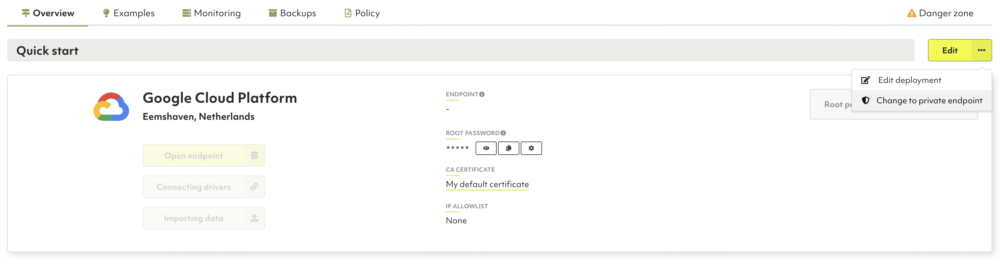
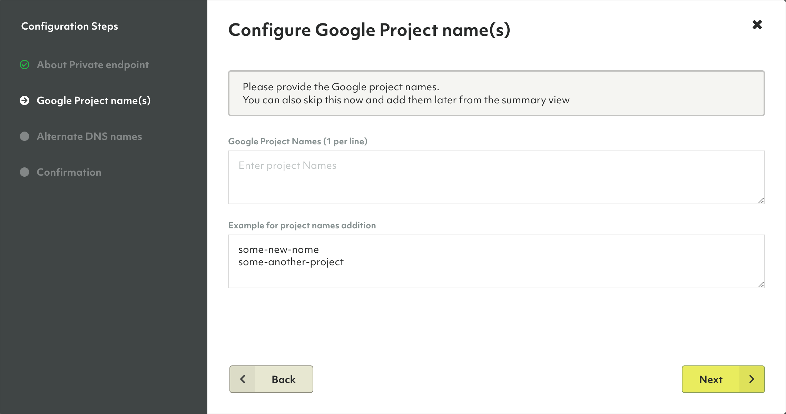
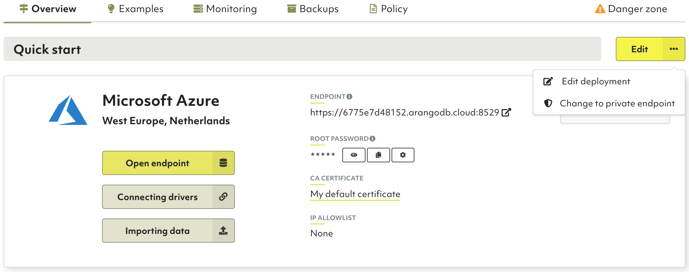
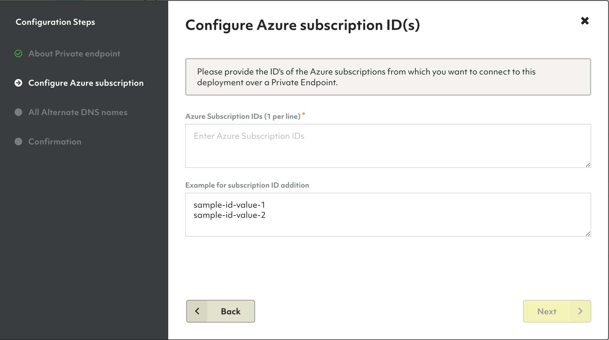
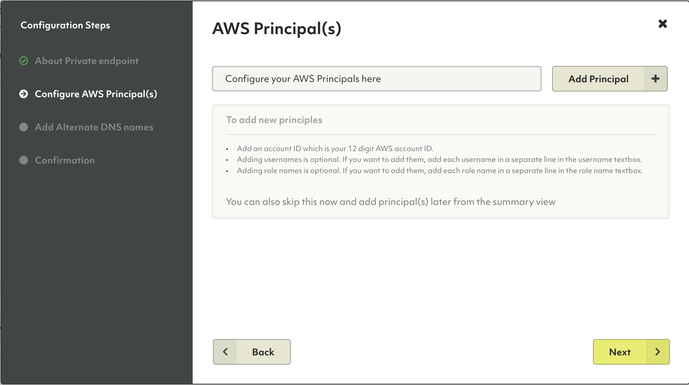
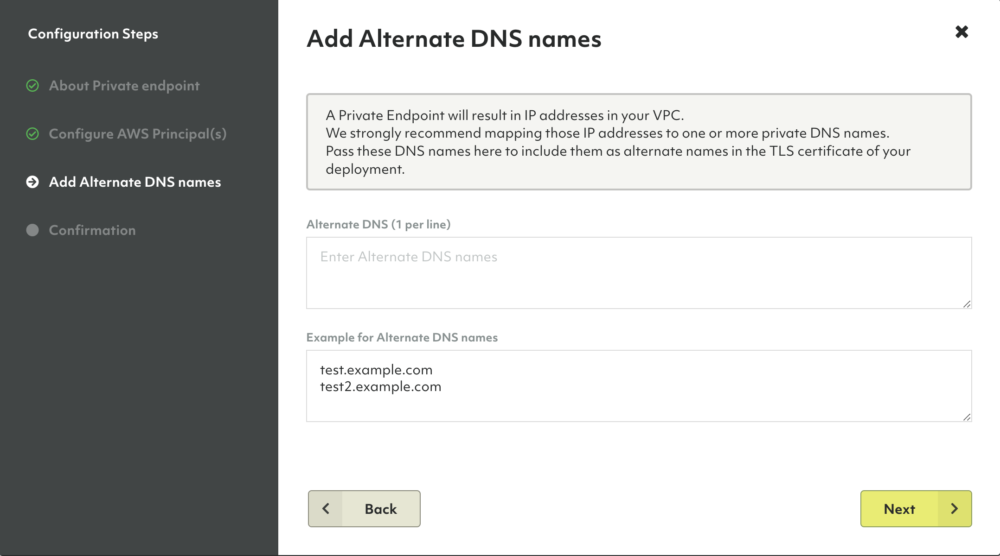
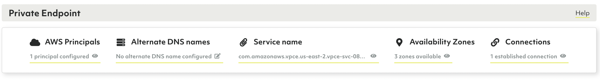

# Private endpoint deployments in ArangoGraph

This topic describes how to create a private endpoint deployment and
securely deploy to various cloud providers such as Google Cloud Platform (GCP),
Microsoft Azure, and Amazon Web Services (AWS). Follow the steps outlined below
to get started.


Private endpoints on Microsoft Azure can be cross region; in AWS they should be
located in the same region.



For more information about the certificates used for private endpoints, please
refer to the [How to manage certificates](certificates.html)
section.


## Google Cloud Platform (GCP)

Google Cloud Platform (GCP) offers a feature called
[Private Service Connect](https://cloud.google.com/vpc/docs/private-service-connect){:target="_blank"}
that allows private consumption of services across VPC networks that belong to
different groups, teams, projects, or organizations. You can publish and consume
services using the defined IP addresses which are internal to your VPC network.

In ArangoGraph, you can
[create a regular deployment](deployments.html#how-to-create-a-new-deployment)
and change it to a private endpoint deployment afterwards.

Such a deployment is not reachable from the internet anymore, other than via
the ArangoGraph dashboard to administrate it. To revert to a public deployment,
please contact support via **Request help** in the help menu.

To configure a private endpoint for GCP, you need to provide your Google project
names. ArangoGraph then configures a **Private Endpoint Service** that automatically
connect to private endpoints that are created for those projects.

After the creation of the **Private Endpoint Service**, you should receive a
service attachment that you need during the creation of your private endpoint(s).

1. Open the deployment you want to change.
2. On the **Overview** tab, click the **Edit** button with an ellipsis (`…`)
   icon. 
3. Click **Change to private endpoint** in the menu.
   
4. In the configuration wizard, click **Next** to enter your configuration details.
5. Enter one or more Google project names. You can also add them later in the summary view.
   Click **Next**.
   
6. Enter one or more alternate DNS names. This step is optional.
   Continue with or without alternate DNS names entered by clicking **Next**.
   The names can be changed later.
7. Click **Confirm Settings** to change the deployment.
8. Back on the **Overview** tab, scroll down to the **Private Endpoint** section
   that is now displayed to see the connection status and to change the
   configuration.
9. ArangoGraph configures a **Private Endpoint Service**. As soon as the
   **Service Attachment** is ready, you can use it to configure the Private
   Service Connect in your VPC.


When you create a private endpoint in ArangoGraph, both endpoints (the regular
one and the new private one) are available for two hours. During this time period,
you can switch your application to the new private endpoint. After this period,
the old endpoint is not available anymore.


## Microsoft Azure

Microsoft Azure offers a feature called
[Azure Private Link](https://docs.microsoft.com/en-us/azure/private-link){:target="_blank"}
that allows you to limit communication between different Azure servers and
services to Microsoft's backbone network without exposure to the internet.
It can lower network latency and increase security.

If you want to connect an ArangoGraph deployment running on Azure with other
services you run on Azure using such a tunnel, then
[create a regular deployment](deployments.html#how-to-create-a-new-deployment)
and change it to a private endpoint deployment afterwards.

The deployment is not reachable from the internet anymore, other than via
the ArangoGraph dashboard to administrate it. To revert to a public deployment,
please contact support via **Request help** in the help menu.

1. Open the deployment you want to change.
2. On the **Overview** tab, click the **Edit** button with an ellipsis (`…`)
   icon.
3. Click **Change to private endpoint** in the menu.
   
4. In the configuration wizard, click **Next** to enter your configuration details.
5. Enter one or more Azure Subscription IDs (GUIDs). They cannot be
   changed anymore once a connection has been established.
   Proceed by clicking **Next**.
   
6. Enter one or more Alternate DNS names. This step is optional.
   Continue with or without Alternate DNS names entered by clicking **Next**.
   They can be changed later.
7. Click **Confirm Settings** to change the deployment.
8. Back on the **Overview** tab, scroll down to the **Private Endpoint** section
   that is now displayed to see the connection status and to change the
   configuration.
9. ArangoGraph configures a **Private Endpoint Service**. As soon as the **Azure alias**
   becomes available, you can copy it and then go to your Microsoft Azure portal
   to create Private Endpoints using this alias. The number of established
   **Connections** increases and you can view the connection details by
   clicking it.


When you create a private endpoint in ArangoGraph, both endpoints (the regular
one and the new private one) are available for two hours. During this time period,
you can switch your application to the new private endpoint. After this period,
the old endpoint is not available anymore.


## Amazon Web Services (AWS)

AWS offers a feature called [AWS PrivateLink](https://aws.amazon.com/privatelink){:target="_blank"}
that enables you to privately connect your Virtual Private Cloud (VPC) to
services, without exposure to the internet. You can control the specific API
endpoints, sites, and services that are reachable from your VPC.

Amazon VPC allows you to launch AWS resources into a
virtual network that you have defined. It closely resembles a traditional
network that you would normally operate, with the benefits of using the AWS
scalable infrastructure. 

In ArangoGraph, you can
[create a regular deployment](deployments.html#how-to-create-a-new-deployment) and change it
to a private endpoint deployment afterwards.

The ArangoDB private endpoint deployment is not exposed to public internet
anymore, other than via the ArangoGraph dashboard to administrate it. To revert
it to a public deployment, please contact the support team via **Request help**
in the help menu.

To configure a private endpoint for AWS, you need to provide the AWS principals related
to your VPC. The ArangoGraph Insights Platform configures a **Private Endpoint Service**
that automatically connects to private endpoints that are created in those principals. 

1. Open the deployment you want to change.
2. In the **Overview** tab, click the **Edit** button with an ellipsis (`…`)
   icon.
3. Click **Change to private endpoint** in the menu.
   
4. In the configuration wizard, click **Next** to enter your configuration details.
5. Click **Add Principal** to start configuring the AWS principal(s). 
   You need to enter a valid account, which is your 12 digit AWS account ID.
   Adding usernames or role names is optional. You can also
   skip this step and add them later from the summary view.
   
   Principals cannot be changed anymore once a connection has been established.
   
   
   To verify your endpoint service in AWS, you must use the same principal as
   configured in ArangoGraph. Otherwise, the service name cannot be verified.
   
   
6. Enter one or more alternate DNS names. This step is optional, you can 
   add or change them later. Click **Next** to continue.
   
7. Confirm that you want to use a private endpoint for your deployment by
   clicking **Confirm Settings**.
8. Back in the **Overview** tab, scroll down to the **Private Endpoint** section
   that is now displayed to see the connection status and change the
   configuration, if needed.
   
   
   Note that
   [Availability Zones](https://docs.aws.amazon.com/AWSEC2/latest/UserGuide/using-regions-availability-zones.html#concepts-availability-zones){:target="_blank"}
   are independently mapped for each AWS account. The physical location of a
   zone may differ from one account to another account. To coordinate
   Availability Zones across AWS accounts, you must use the
   [Availability Zone ID](https://docs.aws.amazon.com/ram/latest/userguide/working-with-az-ids.html){:target="_blank"}.
   
   
   
   To learn more or request help from the ArangoGraph support team, click **Help**
   in the top right corner of the **Private Endpoint** section.
   
9. ArangoGraph configures a **Private Endpoint Service**. As soon as this is available,
   you can use it in the AWS portal to create an interface endpoint to connect
   to your endpoint service. For more details, see
   [How to connect to an endpoint](https://docs.aws.amazon.com/vpc/latest/privatelink/create-endpoint-service.html#share-endpoint-service){:target="_blank"}.


To establish connectivity and enable traffic flow, make sure you add a route
from the originating machine to the interface endpoint. 



When you create a private endpoint in ArangoGraph, both endpoints (the regular
one and the new private one) are available for two hours. During this time period,
you can switch your application to the new private endpoint. After this period,
the old endpoint is not available anymore.
