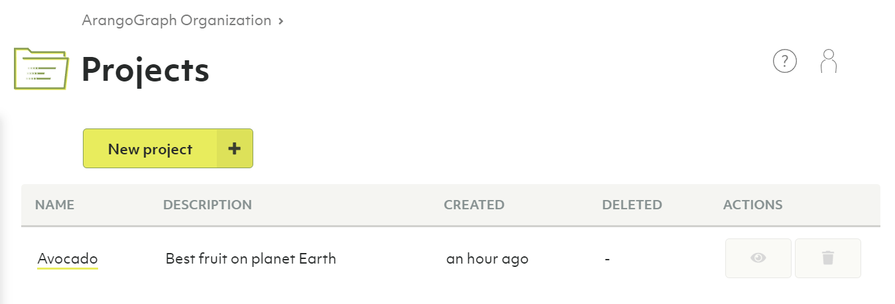
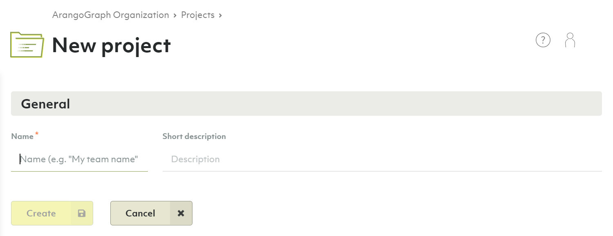
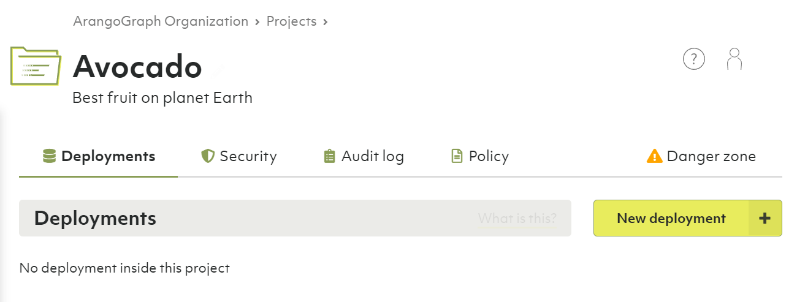
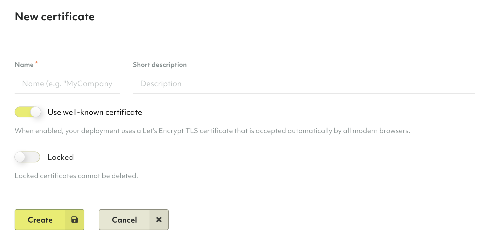
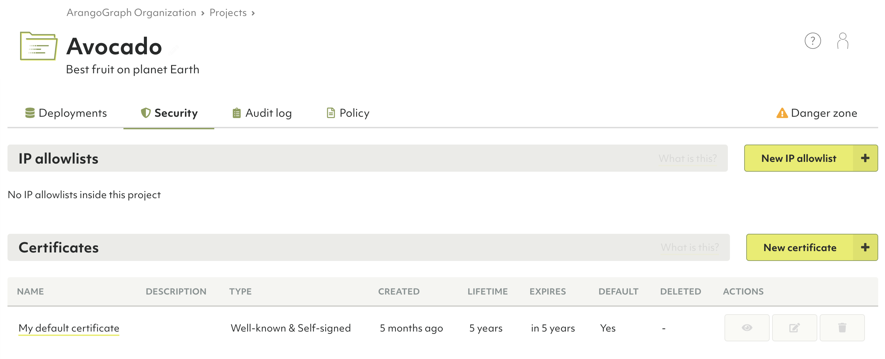
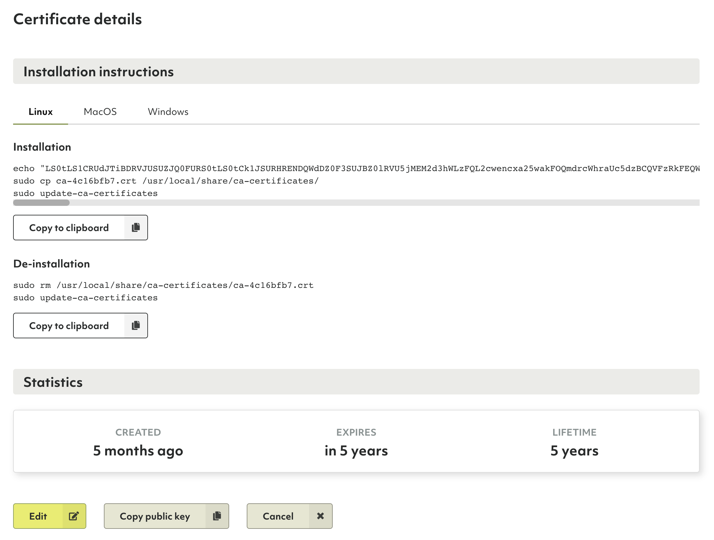

# Projects

Below organizations in the ArangoGraph deployment hierarchy are projects. They can
represent organizational units such as teams, product groups, environments
(e.g. staging vs. production). You can have any number of projects under one
organization.

**Organizations → <u>Projects</u> → Deployments**

Projects are a container for related deployments, certificates & IP allowlists.
Projects also come with their own policy for access control. You can have any
number of deployment under one project.

In essence, you can create whatever structure fits you for a given organization,
its projects and deployments.

## How to create a new project

1. Click __Overview__ in the __Projects__ section of the main navigation.
2. Click the __New project__ button.
3. Enter a name and optionally a description for your new project.
4. Click the __Create__ button.
5. You will be taken to the project page.
6. To change the name or description, click either at the top of the page.


Projects contain exactly **one policy**. Within that policy, you can define
role bindings to regulate access control on a project level.


## How to create a new deployment

See [Deployments: How to create a new deployment](deployments.html#how-to-create-a-new-deployment)

## How to delete a project


Deleting a project will delete contained deployments, certificates & IP allowlists.
This operation is **irreversible**.


1. Click __Overview__ in the __Projects__ section of the main navigation.
2. Click the __recycle bin__ icon in the __Actions__ column.
3. Enter `Delete!` to confirm and click __Yes__.

Alternatively, you can also delete a project via the project page:

1. Click a project name in the __Projects__ section of the main navigation.
2. Click the __Danger zone__ tab.
3. Click the __Delete project...__ button.
4. Enter `Delete!` to confirm and click __Yes__.


If the project has a locked deployment, you need to [unlock](access-control.html#locked-resources)
it first to be able to delete the project.


## How to manage IP allowlists

IP allowlists let you limit access to your deployment to certain IP ranges.
It is optional, but strongly recommended to do so.

You can create an allowlist as part of a project.

1. Click a project name in the __Projects__ section of the main navigation.
2. Click the __Security__ tab.
3. In the __IP allowlists__ section, click:
   - The __New IP allowlist__ button to create a new allowlist.
     When creating or editing a list, you can add comments
     in the __Allowed CIDR ranges (1 per line)__ section. 
     Everything after `//` or `#` is considered a comment until the end of the line.
   - A name or the __eye__ icon in the __Actions__ column to view the allowlist.
   - The __pencil__ icon to edit the allowlist.
     You can also view the allowlist and click the __Edit__ button.
   - The __recycle bin__ icon to delete the allowlist.

## How to manage certificates

Certificates are utilized for encrypted remote administration. The communication
with and between the servers of an ArangoGraph deployment is encrypted using the
TLS protocol.

Each ArangoGraph deployment is accessible on two different port numbers:
- default port `8529`
- high port `18529`

Each ArangoGraph Notebook is accessible on two different port numbers:
- default port `8840`
- high port `18840`

Metrics are accessible on two different port numbers:
- default port `8829`
- high port `18829`

The distinction between these port numbers is in the certificate used for the
TLS connection.

On the default ports, a **well known X509 certificate** created by
[Let's Encrypt](https://letsencrypt.org/){:target="_blank"} is being used. This
certificate has a lifetime of 5 years and is rotated automatically. It is
recommended to use Well known certificates, as this eases the access of a
deployment in your browser.

On the high ports, a **self-signed X509 certificate** is being used. This
certificate has a lifetime of one year and it is automatically created by the
ArangoGraph platform. It is also rotated automatically before the expiration
date.


Unless you switch off the **Use well known certificate** option in the
certificate generation, both the default and high port serve the same
self-signed certificate.


When using [private endpoints](deployments.html#how-to-create-a-private-endpoint-deployment),
[notebooks](notebooks.html), and [metrics](monitoring-metrics.html), you can specify 
alternate domain names which are added only to the self-signed certificate
as Subject Alternative Name (SAN). 

The Subject Alternative Name (SAN) is an extension to the X. 509 specification 
that allows you to specify additional host names for a single SSL certificate.
The SAN is **not** included in the well known certificate generated by
Let's Encrypt.

Certificates that have the __Use well known certificate__ option enabled do
not need any installation and will be supported by almost all web-browsers
automatically.

When creating a certificate that has the __Use well known certificate__ option
disabled, the certificate needs to be installed on
your local machine as well. This operation slightly varies between operating
systems.

1. Click a project name in the __Projects__ section of the main navigation.
2. Click the __Security__ tab.
3. In the __Certificates__ section, click:
   - The __New certificate__ button to create a new certificate.
   - A name or the __eye__ icon in the __Actions__ column to view a certificate.
     The dialog that opens provides commands for installing and uninstalling
     the certificate through a console.
   - The __pencil__ icon to edit a certificate.
     You can also view a certificate and click the __Edit__ button.
   - The __tag__ icon to make the certificate the new default.
   - The __recycle bin__ icon to delete a certificate.

### Certificate Rotation

Every certificate has a self-signed root certificate that is going to expire.
When certificates that are used in existing deployments are about to expire,
an automatic rotation of the certificates is triggered. This means that the
certificate is cloned and all affected deployments then start using
the cloned certificate. 

Based on the type of certificate used, you may also need to install the new
certificate on your local machine. To prevent any downtime, it is recommended to
manually create a new certificate and apply the required changes prior
to the expiration date. 

## How to manage role bindings

See:
- [Access Control: How to view, edit or remove role bindings of a policy](access-control.html#how-to-view-edit-or-remove-role-bindings-of-a-policy)
- [Access Control: How to add a role binding to a policy](access-control.html#how-to-add-a-role-binding-to-a-policy)
