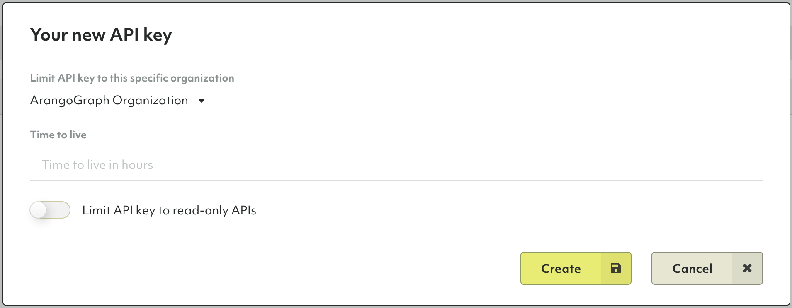

# Single Sign-On (SSO)


This feature is only available in ArangoGraph Enterprise.


ArangoGraph provides support to enable **Single Sign-On** (SSO) authentication
using **Security Assertion Markup language 2.0** (SAML 2.0) with the
**System for Cross-domain Identity Management** (SCIM) provisioning. 
This enables you to propagate to ArangoGraph any user access changes by using
the dedicated API.


To enable the Single Sign-On (SSO) feature, please
[contact us](https://www.arangodb.com/contact){:target="_blank"}.


## About SAML 2.0

The Security Assertion Markup language 2.0 (SAML 2.0) is an open standard created
to provide cross-domain single sign-on (SSO). It allows you to authenticate in
multiple web applications by using a single set of login credentials.

SAML SSO works by transferring user authentication data from the identity
provider (IdP) to the service provider (SP) through an exchange of digitally
signed XML documents.

## About SCIM

[SCIM](https://www.rfc-editor.org/rfc/rfc7644){:target="_blank"}, or the System
for Cross-domain Identity Management [specification](http://www.simplecloud.info/){:target="_blank"},
is an open standard designed to manage user identity information.
SCIM provides a defined schema for representing users, and a RESTful
API to run CRUD operations on these user resources.

The SCIM specification expects the following operations so that the SSO system
can sync the information about user resources in real-time:

- `GET /Users` - Lists all users.
- `GET /Users/:user_id` - Get details for a given user ID.
- `POST /Users` - Invite a new user to ArangoGraph.
- `PUT /Users/:user_id` - Update a given user ID.
- `DELETE /Users/:user_id` - Delete a specified user ID.

ArangoGraph organization administrators can generate an API key for a specific organization.
The API token consists of a key and a secret. Using this key and secret as the
Basic Authentication Header (Basic Auth) in SCIM provisioning, you can access the APIs and
manage the user resources.

To learn how to generate a new API key in the ArangoGraph Dashboard, see the
[API Keys](my-account.html#api-keys) section.


When creating an API key, it is required to select an organization from the
list.


## Configure SAML 2.0 and SCIM using Okta

You can enable SSO for your ArangoGraph organization using Okta as an Identity
Provider (IdP). For more information about Okta, please refer to the
[Okta Documentation](https://help.okta.com/en-us/Content/index.htm?cshid=csh-index){:target="_blank"}.

### Create the SAML app integration in Okta

1. Go to Okta and select **Applications** from the left sidebar menu.
2. Click **Create App Integration**.
3. In the **Create a new app integration** dialog, select **SAML 2.0**.

   
4. In the **General Settings**, specify a name for your integration.

   
5. Click **Next**.  
6. Configure the SAML settings:
   - For **Single sign-on URL**, use `https://auth.arangodb.com/login/callback?connection=ORG_ID`
   - For **Audience URI (SP Entity ID)**, use `urn:auth0:arangodb:ORG_ID`
   
   
   Replace **ORG_ID** with your organization identifier from the 
   ArangoGraph Dashboard. To find your organization ID, go to the **User Toolbar**
   in the top right corner, which is accessible from every view of the Dashboard,
   and click **My organizations**.
   

   
7. In the **Attribute Statements** section, define the following custom attributes:
   - email: `user.email`
   - first_name: `user.firstName`
   - last_name: `user.lastName`
   - email_verified: `true`
   - picture: `user.profileUrl`

   
8. Click **Next**.
9. In the **Configure feedback** section, select **I'm an Okta customer adding an internal app**.
10. Click **Finish**. The SAML app integration is now created.

### SAML Setup

1. After the integration is created, the **SAML Signing Certificates** section 
   is displayed under the **Sign On** tab.
2. To finalize the SSO configuration, you must perform the SAML setup.
3. Click **View SAML setup instructions**.

   
4. The setup instructions include the following items:
   - Identity Provider Single Sign-On URL
   - Identity Provider Issuer
   - X.509 Certificate
5. Copy the IdP settings, download the certificate, and share them with the
   ArangoGraph team in order to complete the SSO configuration.

### Enable SCIM provisioning in Okta

1. To enable SCIM provisioning for your integration, go to the **General** tab.
2. In the **App Settings** section, select **Enable SCIM provisioning**.
3. Navigate to the **Provisioning** tab. The SCIM connection settings are
   displayed under **Settings > Integration**.
4. Fill in the following fields:
   - For **SCIM connector base URL**, use `https://cloud.arangodb.com/api/scim/v1`
   - For **Unique identifier field for users**, use `userName`
5. For **Supported provisioning actions**, enable the following:
   - **Import New Users and Profile Updates**
   - **Push New Users**
   - **Push Profile Updates** 
6. From the **Authentication Mode** menu, select the **Basic Auth** option.
   To authenticate using this mode, you need to provide the username and password
   for the account that handles the SCIM actions - in this case ArangoGraph.
7. Go to the ArangoGraph Dashboard and get your API key ID and Secret. Use
   these authentication tokens as username and password when using the
    **Basic Auth** mode. See also
   [How to create a new API key](my-account.html#how-to-create-a-new-api-key).

   
8. Click **Save**.