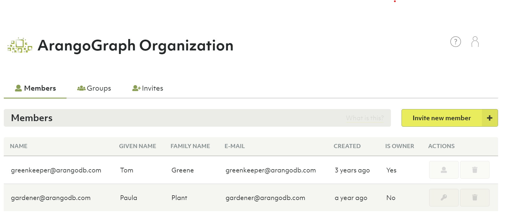
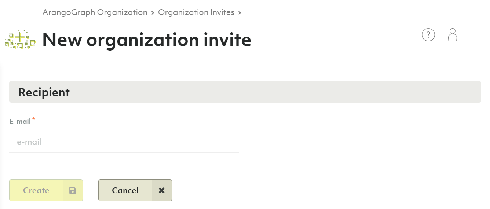
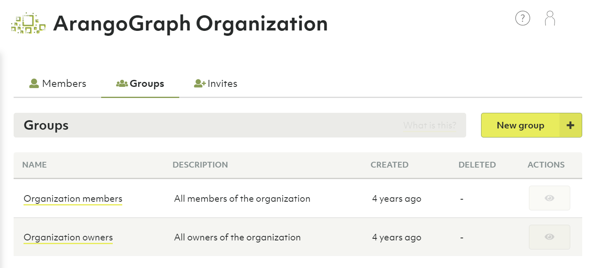
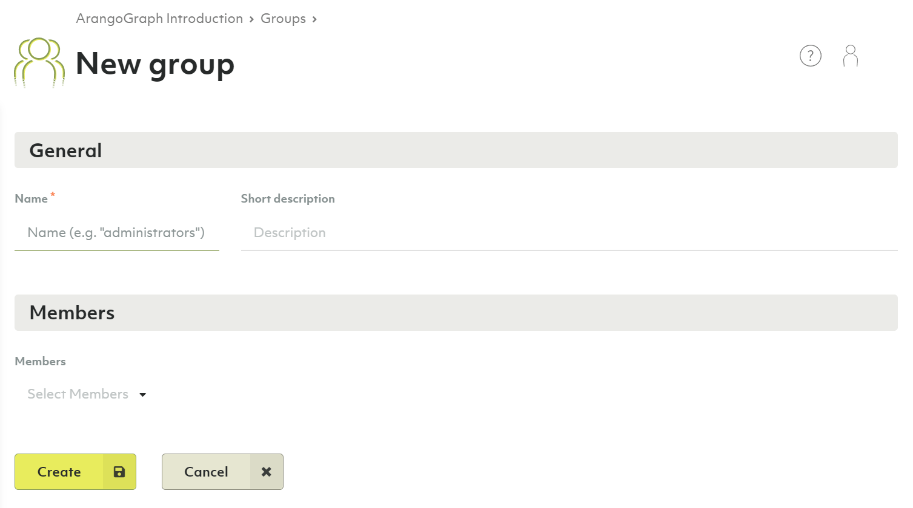
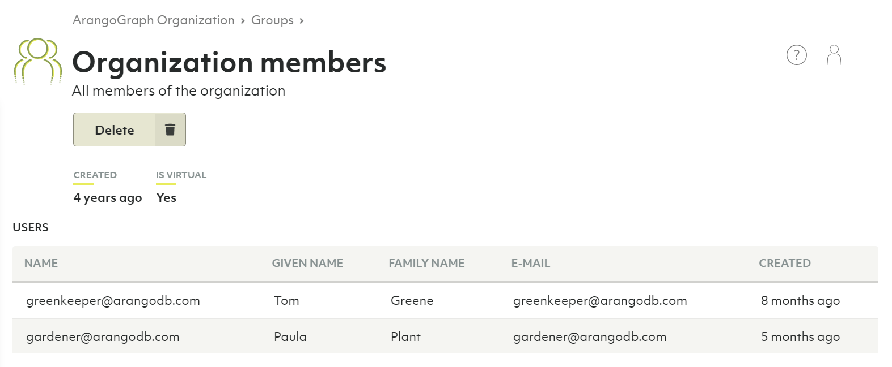
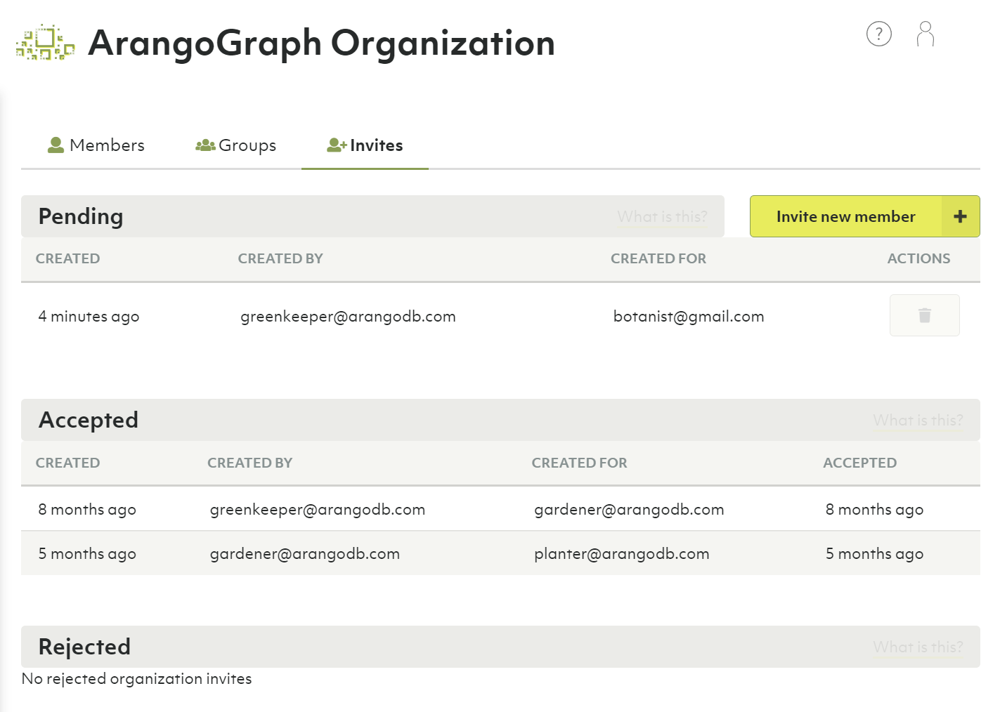

# Users and Groups in ArangoGraph

## Users, groups & members

When you use ArangoGraph, you are logged in as a user.
A user has properties such as name & email address.
Most important of the user is that it serves as an identity of a person.

A user is member of one or more organizations in ArangoGraph.
You can become a member of an organization in the following ways:

- Create a new organization. You will become the first member and owner of that
  organization.
- Be invited to join an organization. Once accepted (by the invited user), this
  user becomes a member of the organization.

If the number of members of an organization becomes large, it helps to group
users. In ArangoGraph a group is part of an organization and a group contains
a list of users. All users of the group must be member of the owning organization.

In the **People** section of the dashboard you can manage users, groups and
invites for the organization.

To edit permissions of members see [Access Control](access-control.html).

## Members

Members are a list of users that can access an organization.

### How to add a new member to the organization

1. In the main navigation, click __People__ in the __Organization__ section.
2. Optionally click the __Invites__ tab.
3. Click the __Invite new member__ button.
4. In the form that appears, enter the email address of the person you want to
   invite.
5. Click the __Create__ button.
6. An email with an organization invite will now be sent to the specified
   email address.
7. After accepting the invite the person will be added to the organization
   [members](#members).

### How to respond to an organization invite

See [My Account: How to respond to my invites](my-account.html#how-to-respond-to-my-invites)

### How to remove a member from the organization

1. Click the __People__ link in the main navigation.
2. Delete a member by pressing the __recycle bin__ icon in the __Actions__ column.
3. Confirm the deletion in the dialog that pops up


You cannot delete members who are organization owners.


### How to make a member an organization owner

1. Click the __People__ link in the main navigation.
2. You can convert a member to an organization owner by pressing the __Key__ icon
   in the __Actions__ column.
3. You can convert a member back to a normal user by pressing the __User__ icon
   in the __Actions__ column.

## Groups

A group is a defined set of members. Groups can then be bound to roles. These
bindings contribute to the respective organization, project or deployment policy.

### How to create a new group

1. Click __People__ in the main navigation, then the __Groups__ tab.
2. Press the __New group__ button.
3. Enter a name and optionally a description for your new group.
4. Select the members you want to be part of the group.
5. Press the __Create__ button.

### How to view, edit or remove a group

1. Click __People__ in the main navigation, then the __Groups__ tab.
2. Click an icon in the __Actions__ column:
   - __Eye__: View group
   - __Pencil__: Edit group
   - __Recycle bin__: Delete group

You can also click a group name to view it. There are buttons to __Edit__ and
__Delete__ the currently viewed group.


The groups __Organization members__ and __Organization owners__ are virtual groups
and cannot be changed. They always reflect the current set of organization
members and owners.


## Invites

### How to create a new organization invite

See [How to add a new member to the organization](#how-to-add-a-new-member-to-the-organization)

### How to view the status of invitations

1. In the main navigation, click __People__ in the __Organization__ section.
2. Click the __Invites__ tab.
3. The created invites are displayed, grouped by status __Pending__,
   __Accepted__ and __Rejected__.
4. You may delete pending invites by clicking the __recycle bin__ icon in the
   __Actions__ column.

