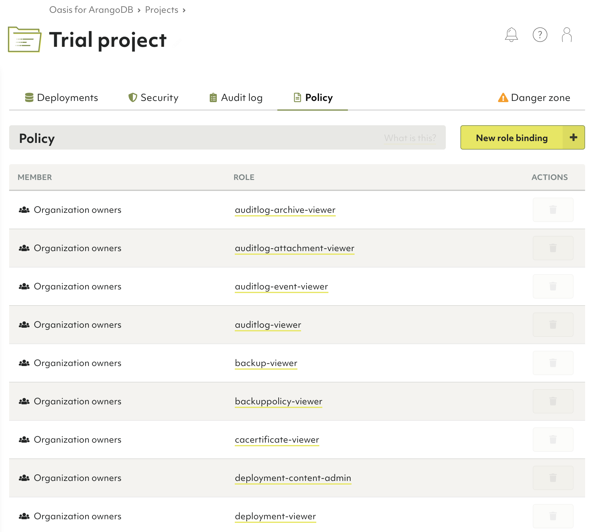
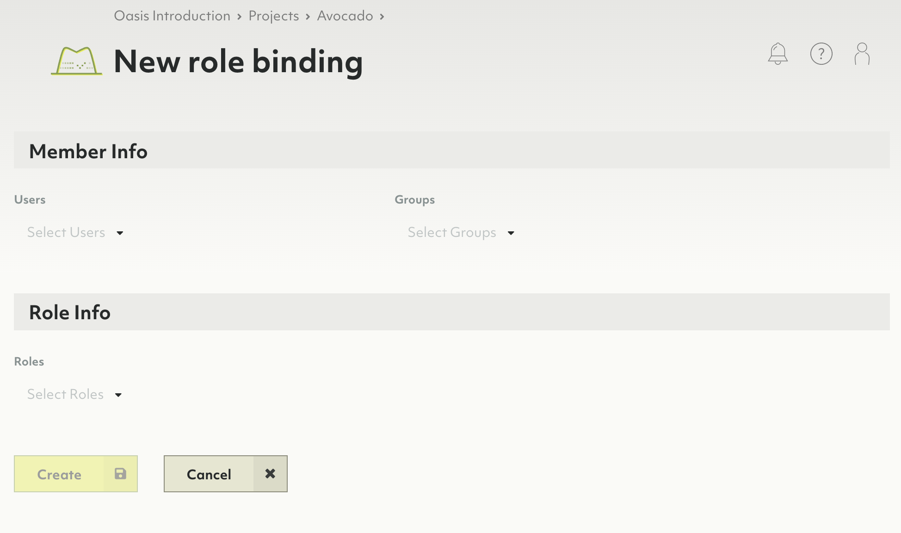
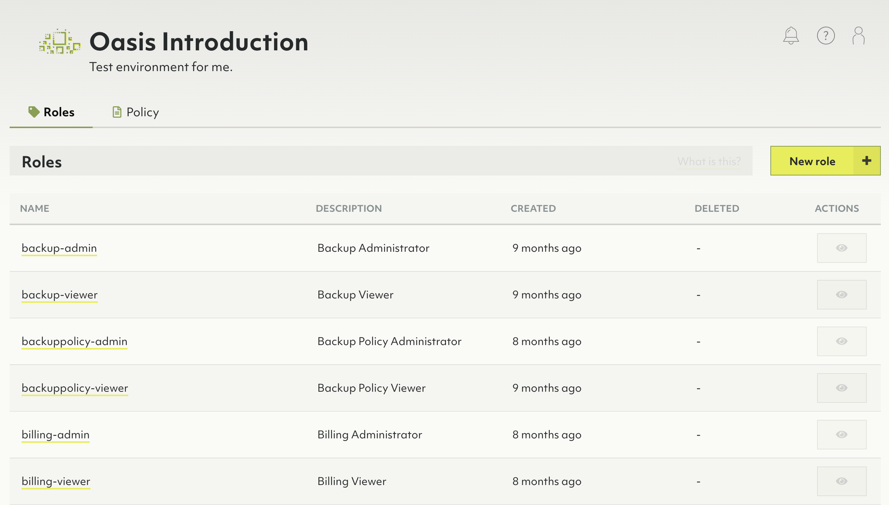
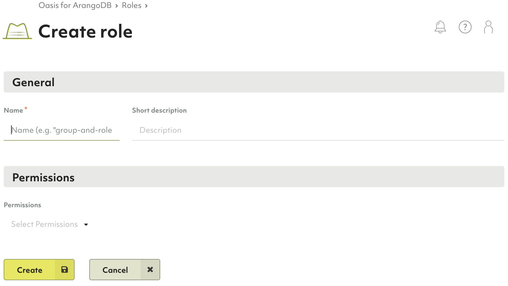

# Access control in ArangoDB Oasis

Oasis has a structured set of resources that are subject to
access control:

- Organizations
- Projects
- Deployments

For each of these resources you can perform various operations.
For example, you can *create* a project in an organization. This requires the
respective **permission**, which can be granted to organization members via a
**role** such as the pre-defined *Project Administrator*.

The association of a member with a role is called a **role binding**.
All role bindings of a resource comprise a **policy**.

Roles can be bound on an organization, project and deployment level (listed in the high to low level order). The lower
levels *inherit* permissions from their parents.

## Policy

To give a user (or a group of users) access to resources of Oasis, you assign
a role to that user (or group). This is done in a **policy**.

A policy is a set of bindings of roles to users or groups for a specific
resource. This means that there is a unique policy per resource (an organization, a project or a deployment).

For example, an organization has exactly one policy,
which binds roles to members of the organization. These bindings are used to
give the users permissions to perform operations on this organization.

### How to view, edit or remove role bindings of a policy

Decide whether you want to edit the policy for an organization, a project or a deployment:

- **Organization**: In the main navigation menu, click **Access Control**, then
  open the **Policy** tab.
- **Project**: In the main navigation menu, click the name of the required project, then
  open the **Policy** tab.
- **Deployment**: In the main navigation menu, click the name of the required project, then click either 
  the deployment name or the **View** button, and finally open the **Policy** tab.

To delete a role binding, click the **Recycle Bin** icon in the **Actions** column.


Currently, you cannot edit a role binding, you can only delete it.


### How to add a role binding to a policy

1. Navigate to the **Policy** tab of an organization, a project or a deployment.
2. Click the **New role binding** button.
3. Select one or more users and/or groups.
4. Select one or more roles you want to assign to the specified members.
5. Click **Create**.

## Roles

Operations on resources in Oasis require zero (just an authentication) or more permissions. Since the
number of permissions is large and very detailed, it is not practical to assign
permissions directly to users. Instead Oasis uses **roles**.

A role is a set of permissions. Roles can be bound to groups (preferably)
or individual users. You can create such bindings for the respective organization,
project or deployment policy.

There are predefined roles, but you can also create custom ones.

### Predefined roles

Predefined roles are created by Oasis and group related permissions together. An example of a predefine role is `deployment-viewer`. This role
contains all permissions needed to view deployments in a project.

Predefined roles cannot be deleted.


Windows command to generate below list (cmd.exe):
oasisctl list roles --format json | jq -r ".[] | \"**\(.description)** (`\(.id)`):\n\(.permissions ^| split(\", \") ^| map(\"- `\(.)`\n\") ^| join(\"\"))""





The roles below are described following this pattern:

**Role description** (`role ID`):
- `Permission`


**Backup Administrator** (`backup-admin`):
- `backup.backup.create`
- `backup.backup.delete`
- `backup.backup.list`
- `backup.backup.get`
- `backup.backup.update`
- `backup.backup.download`
- `backup.backup.restore`
- `data.deployment.restore-backup`

**Backup Viewer** (`backup-viewer`):
- `backup.feature.get`
- `backup.backup.get`
- `backup.backup.list`

**Backup Policy Administrator** (`backuppolicy-admin`):
- `backup.backuppolicy.create`
- `backup.backuppolicy.delete`
- `backup.backuppolicy.list`
- `backup.backuppolicy.get`
- `backup.backuppolicy.update`

**Backup Policy Viewer** (`backuppolicy-viewer`):
- `backup.feature.get`
- `backup.backuppolicy.get`
- `backup.backuppolicy.list`

**Billing Administrator** (`billing-admin`):
- `billing.config.get`
- `billing.config.set`
- `billing.invoice.get`
- `billing.invoice.get-statistics`
- `billing.invoice.list`
- `billing.organization.get`
- `billing.paymentmethod.create`
- `billing.paymentmethod.delete`
- `billing.paymentmethod.get`
- `billing.paymentmethod.get-default`
- `billing.paymentmethod.list`
- `billing.paymentmethod.set-default`
- `billing.paymentmethod.update`
- `billing.paymentprovider.list`

**Billing Viewer** (`billing-viewer`):
- `billing.config.get`
- `billing.invoice.get`
- `billing.invoice.get-statistics`
- `billing.invoice.list`
- `billing.organization.get`
- `billing.paymentmethod.get`
- `billing.paymentmethod.get-default`
- `billing.paymentmethod.list`
- `billing.paymentprovider.list`

**CA Certificate Administrator** (`cacertificate-admin`):
- `crypto.cacertificate.create`
- `crypto.cacertificate.delete`
- `crypto.cacertificate.list`
- `crypto.cacertificate.get`
- `crypto.cacertificate.set-default`
- `crypto.cacertificate.update`

**CA Certificate Viewer** (`cacertificate-viewer`):
- `crypto.cacertificate.get`
- `crypto.cacertificate.list`

**Deployment Administrator** (`deployment-admin`):
- `data.cpusize.list`
- `data.deployment.create`
- `data.deployment.create-test-database`
- `data.deployment.delete`
- `data.deployment.resume`
- `data.deployment.get`
- `data.deployment.list`
- `data.deployment.update`
- `data.deploymentfeatures.get`
- `data.deploymentprice.calculate`
- `data.limits.get`
- `data.nodesize.list`
- `data.presets.list`
- `monitoring.logs.get`

**Deployment Content Administrator** (`deployment-content-admin`):
- `data.cpusize.list`
- `data.deployment.create-test-database`
- `data.deployment.get`
- `data.deployment.list`
- `data.deploymentcredentials.get`
- `data.deploymentfeatures.get`
- `data.limits.get`
- `data.nodesize.list`
- `data.presets.list`
- `monitoring.logs.get`

**Deployment Viewer** (`deployment-viewer`):
- `data.cpusize.list`
- `data.deployment.get`
- `data.deployment.list`
- `data.deploymentfeatures.get`
- `data.limits.get`
- `data.nodesize.list`
- `data.presets.list`

**Example Datasets Viewer** (`exampledataset-viewer`):
- `example.exampledataset.list`
- `example.exampledataset.get`

**Example Dataset Installation Administrator** (`exampledatasetinstallation-admin`):
- `example.exampledatasetinstallation.list`
- `example.exampledatasetinstallation.get`
- `example.exampledatasetinstallation.create`
- `example.exampledatasetinstallation.update`
- `example.exampledatasetinstallation.delete`

**Example Dataset Installation Viewer** (`exampledatasetinstallation-viewer`):
- `example.exampledatasetinstallation.list`
- `example.exampledatasetinstallation.get`

**Group Administrator** (`group-admin`):
- `iam.group.create`
- `iam.group.delete`
- `iam.group.list`
- `iam.group.get`
- `iam.group.update`

**Group Viewer** (`group-viewer`):
- `iam.group.get`
- `iam.group.list`

**IAM provider Administrator** (`iamprovider-admin`):
- `security.iamprovider.create`
- `security.iamprovider.delete`
- `security.iamprovider.get`
- `security.iamprovider.list`
- `security.iamprovider.set-default`
- `security.iamprovider.update`

**IAM provider Viewer** (`iamprovider-viewer`):
- `security.iamprovider.get`
- `security.iamprovider.list`

**IP allowlist Administrator** (`ipallowlist-admin`):
- `security.ipallowlist.create`
- `security.ipallowlist.delete`
- `security.ipallowlist.get`
- `security.ipallowlist.list`
- `security.ipallowlist.update`
- `security.ipallowlist.create`
- `security.ipallowlist.delete`
- `security.ipallowlist.get`
- `security.ipallowlist.list`
- `security.ipallowlist.update`

**IP allowlist Viewer** (`ipallowlist-viewer`):
- `security.ipallowlist.get`
- `security.ipallowlist.list`
- `security.ipallowlist.get`
- `security.ipallowlist.list`

**Organization Administrator** (`organization-admin`):
- `billing.organization.get`
- `resourcemanager.organization.delete`
- `resourcemanager.organization.get`
- `resourcemanager.organization.update`
- `resourcemanager.organization-invite.create`
- `resourcemanager.organization-invite.delete`
- `resourcemanager.organization-invite.get`
- `resourcemanager.organization-invite.list`
- `resourcemanager.organization-invite.update`

**Organization Viewer** (`organization-viewer`):
- `billing.organization.get`
- `resourcemanager.organization.get`
- `resourcemanager.organization-invite.get`
- `resourcemanager.organization-invite.list`

**Policy Administrator** (`policy-admin`):
- `iam.policy.get`
- `iam.policy.update`

**Policy Viewer** (`policy-viewer`):
- `iam.policy.get`

**Project Administrator** (`project-admin`):
- `resourcemanager.project.create`
- `resourcemanager.project.delete`
- `resourcemanager.project.get`
- `resourcemanager.project.list`
- `resourcemanager.project.update`

**Project Viewer** (`project-viewer`):
- `resourcemanager.project.get`
- `resourcemanager.project.list`

**Replication Administrator** (`replication-admin`):
- `replication.deployment.clone-from-backup`

**Role Administrator** (`role-admin`):
- `iam.role.create`
- `iam.role.delete`
- `iam.role.list`
- `iam.role.get`
- `iam.role.update`

**Role Viewer** (`role-viewer`):
- `iam.role.get`
- `iam.role.list`



### How to create a custom role

1. In the main navigation menu, click **Access Control**.
2. On the **Roles** tab, click **New role**.
3. Enter a name and optionally a description for the new role.
4. Select the required permissions.
5. Click **Create**.

### How to view, edit or remove a custom role

1. In the main navigation menu, click **Access Control**.
2. On the **Roles** tab, click:
   - A role name or the **eye** icon in the **Actions** column to view the role.
   - The **pencil** icon in the **Actions** column to edit the role.
     You can also view a role and click the **Edit** button in the detail view.
   - The **recycle bin** icon to delete the role.
     You can also view a role and click the **Delete** button in the detail view.

## Permissions

Each operation done on a resource requires zero (just authentication) or more **permissions**.
A permission is a constant string such as `resourcemanager.project.create`,
following this schema: `<api>.<kind>.<verb>`.

Permissions are solely defined by the Oasis API.

| API               | Kind                         | Verbs
|:------------------|:-----------------------------|:-------------------------------------------
| `backup`          | `backuppolicy`               | `create`, `delete`, `get`, `list`, `update`
| `backup`          | `backup`                     | `create`, `delete`, `download`, `get`, `list`, `restore`, `update`
| `backup`          | `feature`                    | `get`
| `billing`         | `config`                     | `get`, `set`
| `billing`         | `invoice`                    | `get`, `get-statistics`, `list`
| `billing`         | `organization`               | `get`
| `billing`         | `paymentmethod`              | `create`, `delete`, `get`, `get-default`, `list`, `set-default`, `update`
| `billing`         | `paymentprovider`            | `list`
| `crypto`          | `cacertificate`              | `create`, `delete`, `get`, `list`, `set-default`, `update`
| `data`            | `cpusize`                    | `list`
| `data`            | `deploymentcredentials`      | `get`
| `data`            | `deploymentfeatures`         | `get`
| `data`            | `deploymentprice`            | `calculate`
| `data`            | `deployment`                 | `create`, `create-test-database`, `delete`, `get`, `list`, `restore-backup`, `resume`, `update`
| `data`            | `limits`                     | `get`
| `data`            | `nodesize`                   | `list`
| `data`            | `presets`                    | `list`
| `example`         | `exampledatasetinstallation` | `create`, `delete`, `get`, `list`, `update`
| `example`         | `exampledataset`             | `get`, `list`
| `iam`             | `group`                      | `create`, `delete`, `get`, `list`, `update`
| `iam`             | `policy`                     | `get`, `update`
| `iam`             | `role`                       | `create`, `delete`, `get`, `list`, `update`
| `monitoring`      | `logs`                       | `get`
| `replication`     | `deployment`                 | `clone-from-backup`
| `resourcemanager` | `organization-invite`        | `create`, `delete`, `get`, `list`, `update`
| `resourcemanager` | `organization`               | `delete`, `get`, `update`
| `resourcemanager` | `project`                    | `create`, `delete`, `get`, `list`, `update`
| `security`        | `iamprovider`                | `create`, `delete`, `get`, `list`, `set-default`, `update`
| `security`        | `ipallowlist`                | `create`, `delete`, `get`, `list`, `update`

### Permission inheritance

Each resource (organization, project, deployment) has its own policy, but this does not mean that you have to
repeat role bindings in all these policies.

Once you assign a role to a user (or group of users) in a policy at one level,
all the permissions of this role are inherited in lower levels - 
permissions are inherited downwards from an organization to its projects and
from a project to its deployments.

For more general permissions, which you want to be propagated to other levels, add a role for a user/group 
at the organization level.
For example, if you bind the `deployment-viewer` role to user `John` in the
organization policy, `John` will have the role permissions in all projects of that organization and all deployments of the projects.

For more restrictive permissions, which you don't necessarily want to be propagated to other levels, add a role at the project
or even deployment level.
For example, if you bind the `deployment-viewer` role to user `John`
in a project, `John` will have the role permissions in
this project as well as in all the deployments of it, but not
in other projects of the parent organization.

**Inheritance example**

- Let's assume you have a group called "Deployers" which includes users who deal with deployments.
- Then you create a role "Deployment Viewer", containing
  `data.deployment.get` and `data.deployment.list` permissions.
- You can now add a role binding of the "Deployers" group to the "Deployment Viewer" role.
- If you add the binding to an organization policy, members of this group
  will be granted the defined permissions for the organization, all its projects and all its deployments.
- If you add the role binding to a policy of project ABC, members of this group will be granted
  the defined permissions for project ABC only and its deployments, but not for
  other projects and their deployments.
- If you add the role binding to a policy of deployment X, members of this
  group will be granted the defined permissions for deployment X only, and not
  any other deployment of the parent project or any other project of the organization.

The "Deployment Viewer" role is effective for the following entities depending
on which policy the binding is added to:

Role binding added to → Role effective on ↓ | Organization policy | Project ABC's policy | Deployment X's policy of project ABC |
|:---:|:---:|:---:|:---:|
Organization, its projects and deployments | ✓ | — | —
Project ABC and its deployments              | ✓ | ✓ | —
Project DEF and its deployments              | ✓ | — | —
Deployment X of project ABC                 | ✓ | ✓ | ✓
Deployment Y of project ABC                  | ✓ | ✓ | —
Deployment Z of project DEF                  | ✓ | — | —

## Restricting access to organizations

To enhance security, you can limit which authentication providers are accepted for users trying to access an organization in Oasis.

To do this, you need to use [Oasisctl](oasisctl.html). The following commands are available:

- `get organization authentication providers` - allows you to see which authentication providers are enabled for accessing a specific organization
- `update organization authentication providers` - allows you to update a list of authentication providers for an organization to which the authenticated user has access
  - `--enable-github` - if set, allow access from user accounts authenticated via Github
  - `--enable-google` - if set, allow access from user accounts authenticated via Google
  - `--enable-username-password` - if set, allow access from user accounts authenticated via a username/password