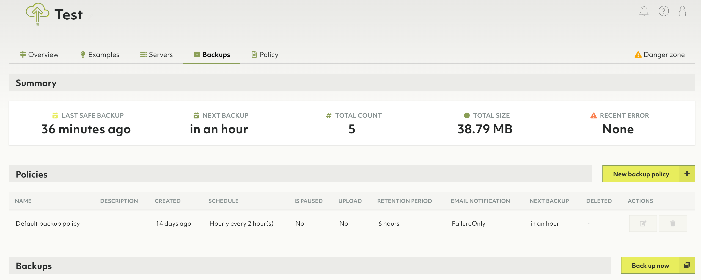
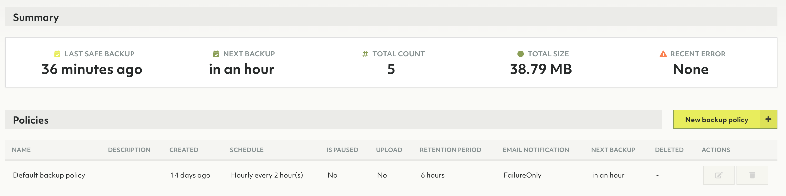
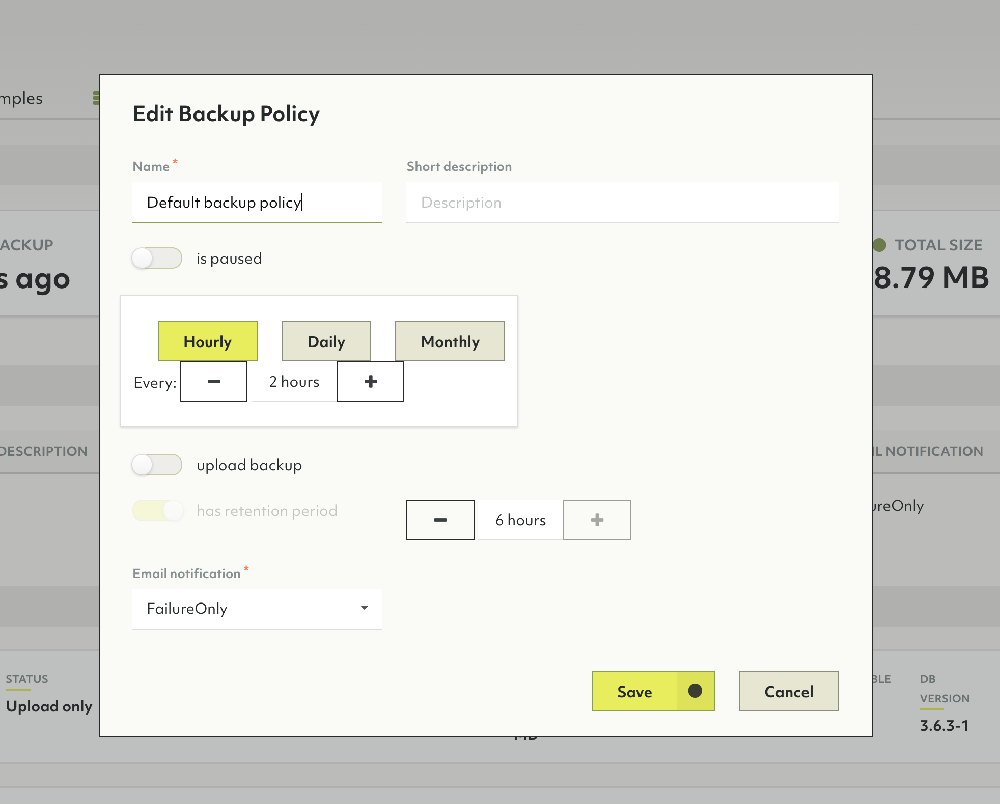
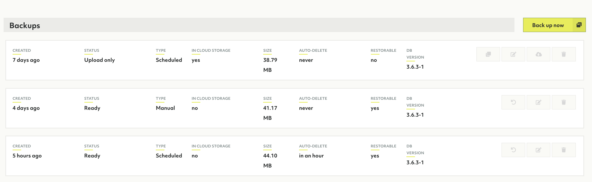
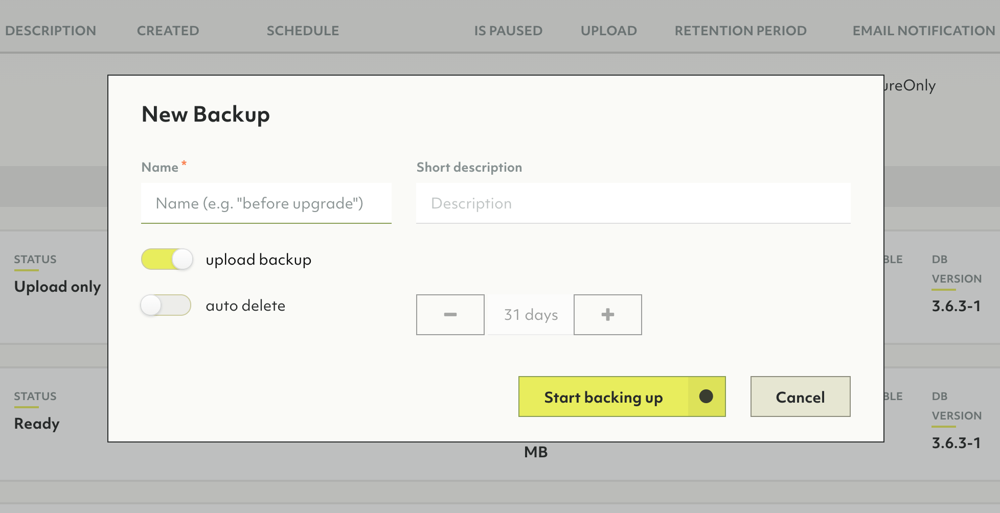
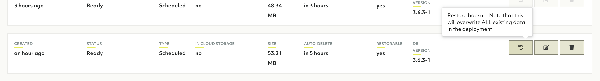
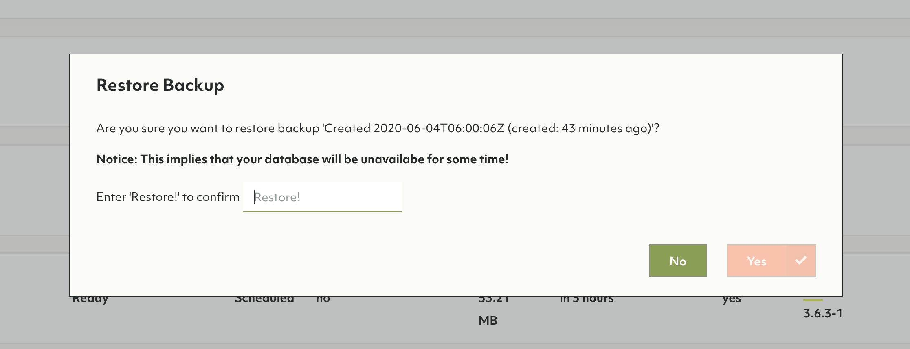
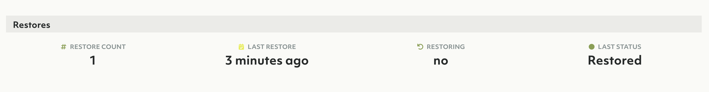
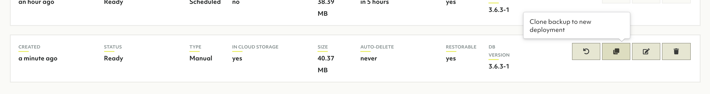
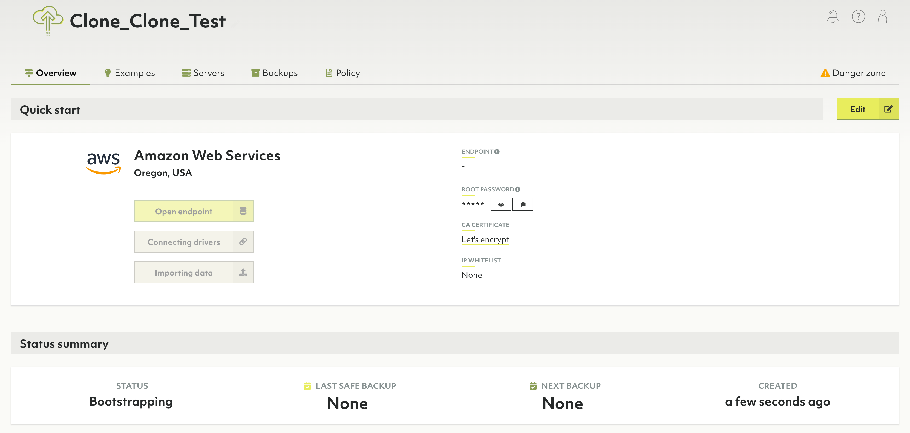

# Backups in Oasis

## How to create backups

To backup data in Oasis for an ArangoDB installation, navigate to the
**Backups** section of your deployment created previously.

There are two ways to create backups. Create periodic backups using a
**Backup policy**, or create a backup manually.

### Periodic backups

Periodic backups are created at a given schedule. To see when the new backup is
due, observe the schedule section.

When a new deployment is created, a default **Backup policy** is created for it
as well. This policy will create backups every two hours. To edit this policy
(or any policy), highlight it in the row above and hit the pencil icon.

These backups are not automatically uploaded.

### Manual backups

It's also possible to create a backup on demand. To do this, click **Back up now**.

### Uploading backups

By default a backup is not uploaded to the cloud, instead it remains on the
servers of the deployment. To make a backup that is resilient against server
(disk) failures, upload the backup to cloud storage. Uploaded backups are
required for [cloning](#how-to-clone-deployments-using-backups).

## How to restore backups

To restore a database from a backup, highlight the desired backup and click the restore icon.


All current data will be lost when restoring.
During restore the deployment is temporarily not available.


## How to clone deployments using backups


The cloned deployment will have the exact same features as the previous
deployment including node size, model, cloud provider & region. The data
contained in the backup will be restored to this new deployment.

The *root password* for this deployment will be different.


1. Highlight the backup you wish to clone from and hit **Clone backup to new deployment**

   

2. The view should navigate to the new deployment being bootstrapped

   

This feature is also available through [oasisctl](oasisctl.html).
