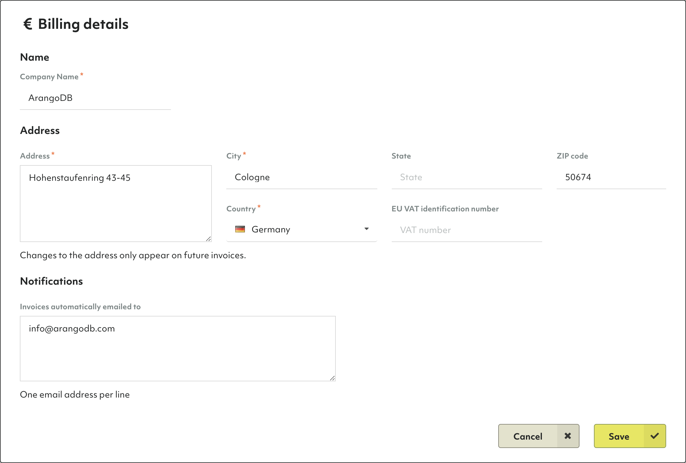

# Billing

## How to add billing details

1. Click on _Overview_ in the _Organization_ section of the main navigation.
2. Click on the _Billing_ tab.
3. In the _Billing Details_ section, click the _Edit_ button.
4. Enter your billing address and EU VAT identification number (if applicable).
5. Optionally, enter the email address(es) to which invoices should be emailed
   to automatically.
6. Click on _Save_.

## How to add a payment method

1. Click on _Overview_ in the _Organization_ section of the main navigation.
2. Click on the _Billing_ tab.
3. In the _Payment methods_ section, click the _Add_ button.
4. From the dropdown, select a payment type
   (currently, only credit card is supported).
5. Fill out the form with your credit card details.
6. Click the _Save_ button.


TODO: Need screenshot with invoice

### How to view invoices

1. In the _Invoices_ section,


