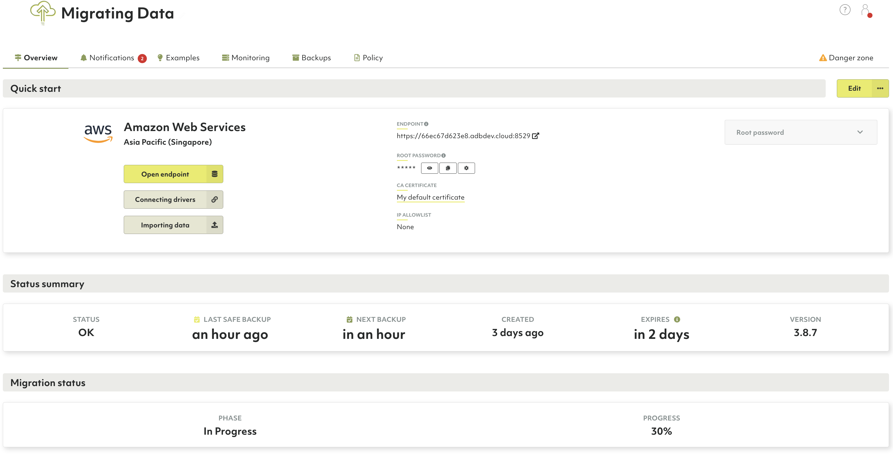

# Cloud Migration Tool

{{ page.description }}
{:class="lead"}


This documentation describes the preview version of the Cloud Migration tool
and is subject to change.


The `arangosync-migration` tool allows you to easily move from on-premises to 
the cloud while ensuring a smooth transition with minimal downtime.
Start the cloud migration, let the tool do the job and, at the same time,
keep your local cluster up and running. 

Some of the key benefits of the cloud migration tool include:
- Safety comes first - pre-checks and potential failures are carefully handled.
- Your data is secure and fully encrypted.
- Ease-of-use with a live migration while your local cluster is still in use.
- Get access to what a cloud-based fully managed service has to offer: 
high availability and reliability, elastic scalability, and much more.

## Downloading the tool

The `arangosync-migration` tool is available to download for the following
operating systems:

**Linux**
- [AMD64 (x86_64) architecture](https://download.arangodb.com/arangosync-migration/linux/amd64/arangosync-migration){:target="_blank"}
- [ARM64 (AArch64) architecture](https://download.arangodb.com/arangosync-migration/linux/arm64/arangosync-migration){:target="_blank"}

**macOS / Darwin**
- [AMD64 (x86_64) architecture](https://download.arangodb.com/arangosync-migration/darwin/amd64/arangosync-migration){:target="_blank"}
- [ARM64 (AArch64) architecture](https://download.arangodb.com/arangosync-migration/darwin/arm64/arangosync-migration){:target="_blank"}

**Windows**
- [AMD64 (x86_64) architecture](https://download.arangodb.com/arangosync-migration/windows/amd64/arangosync-migration.exe){:target="_blank"}
- [ARM64 (AArch64) architecture](https://download.arangodb.com/arangosync-migration/windows/arm64/arangosync-migration.exe){:target="_blank"}

For macOs as well as other Unix-based operating systems, run the following 
command to make sure you can execute the binary:

```bash
chmod 755 ./arangosync-migration
```

## Prerequisites 

Before getting started, make sure the following prerequisites are in place:

- Go to [Oasis Cloud](https://cloud.arangodb.com/home){:target="_blank"}
and sign in. If you don’t have an account yet, sign-up to create one.

- Generate an Oasis API key and API secret. See a detailed guide on 
[how to create an API key](api-getting-started.html#creating-an-api-key).

- Your on-premises deployment should be able to communicate with the Oasis
platform. Check if the host is available and your firewall is not blocking
port `8629`.  


The cloud migration tool is only available for clusters.


### Setting up the target deployment in Oasis

Continue by [creating a new Oasis deployment](deployments.html#how-to-create-a-new-deployment)
or choose an existing one.

The target deployment in Oasis requires specific configuration rules to be
set up before the migration can start:

- **Configuration settings**: The target deployment must be compatible with the
source data cluster. This includes the ArangoDB version that is being used,
the DB-Servers count, and disk space.
- **Deployment region and cloud provider**: Choose the closest region to your
data cluster. This factor can speed up your migration to the cloud.

After setting up your Oasis deployment, wait for a few minutes for it to become
fully operational.


Note that Developer mode deployments are not supported.


## Running the migration tool

The `arangosync-migration` tool provides a set of commands that allow you to:
-  start the migration process
-  check whether your source and target clusters are fully compatible
-  get the current status of the migration process
-  stop or abort the migration process
-  switch the local cluster to read-only mode

### Starting the migration process

To start the migration process, run the following command:

```bash
arangosync-migration start
```
The `start` command runs some pre-checks. Among other things, it measures
the disk space which is occupied by your ArangoDB cluster. If you are using the
same data volume for ArangoDB servers and other data as well, the measurements
can be incorrect. Provide the `--source.ignore-metrics` option to overcome this.

You also have the option of doing a `--check-only` without starting the actual
migration. If specified, this checks if your local cluster and target deployment
are compatible without sending any data to Oasis.

Once the migration starts, the local cluster enters into monitoring mode and the
synchronization status is displayed in real-time. If you don't want to see the
status you can also terminate this process, as the underlying agent process
continues to work. If something goes wrong, restarting the same command restores
the replication state.

To restart the migration, first `stop` or `stop --abort` the migration. Then,
start it again using the `start` command.
Note that restarting works only if you are not using
auto-generated certificates.


Starting the migration creates a full copy of all data from the source cluster
to the target deployment in Oasis. All data that has previously existed in the
target deployment will be lost.


### During the migration

The following takes place during an active migration:
- The source data cluster remains usable. 
- The target deployment in Oasis is switched to read-only mode.
- Your root user password is not copied to the target deployment in Oasis.
To get your root password, select the target deployment from the Oasis
Dashboard and go to the **Overview** tab. All other users are fully synchronized.


The migration tool increases the CPU and memory usage of the server you are
running it on. Depending on your ArangoDB usage pattern, it may take a lot of CPU
to handle the replication. You can stop the migration process anytime
if you see any problems.


During active migration, the agent HTTPS server is executed on the `$MG_HOST:8629` 
endpoint. Make sure the host and port are available for the Oasis platform.
To change the default port, use the `--agent.master-port` option.

```bash
export MG_HOST=<your IP or publicly-available hostname here>
./arangosync-migration start \
  --source.cacert=tls-ca.crt \
  --source.keyfile=client-auth.keyfile \
  --source.endpoint=$COORDINATOR_ENDPOINT \
  --source.jwtSecret=clusterSecret \
  --oasis.api-key=$OASIS_API_KEY \
  --oasis.api-secret=$OASIS_API_SECRET \
  --oasis.deployment-id=$OASIS_DEPLOYMENT_ID \
  --agent.listen-host=$MG_HOST
```

### TLS server certificates

The migration agent HTTPS server uses TLS certificate pairs to ensure a secure
connection between your local cluster and the Oasis platform.
If you do not provide them, the migration tool creates self-signed certificates.
If you wish to provide TLS certificates, use the `arangodb` tool to convert them in
a suitable format for the migration tool.
See a detailed guide on how to [create a new certificate/keyfile pair](../programs-starter-security.html).
Make sure to specify your publicly available host name, `$MG_HOST`, when creating
the keyfile. 

When starting the migration, specify the generated files in the command line:

```bash
--agent.cacert=tls.crt --agent.keyfile=tls.keyfile --agent.client-auth-cacert=client-auth-ca.crt --agent.client-auth-keyfile=client-auth.keyfile
```

### How long does it take?

The total time required to complete the migration depends on how much data you
have and how often write operations are executed during the process.

You can also track the progress by checking the **Migration status** section of
your target deployment in Oasis dashboard.



### Getting the current status

To print the current status of the migration, run the following command:

```bash
./arangosync-migration status --watch \
  --oasis.api-key=$OASIS_API_KEY \
  --oasis.api-secret=$OASIS_API_SECRET \
  --oasis.deployment-id=$OASIS_DEPLOYMENT_ID
```

You can also add the `--watch` option to start monitoring the status in real-time.

### Stopping the migration process

The `arangosync-migration stop` command stops the migration and terminates
the migration agent process.

If replication is running normally, the command waits until all shards are
in sync. The local cluster is then switched into read-only mode.
After all shards are in-sync and the migration stopped, the target deployment
is switched into normal mode (read/write) while the source cluster stays in
read-only mode. 

```bash
./arangosync-migration stop \
  --oasis.api-key=$OASIS_API_KEY \
  --oasis.api-secret=$OASIS_API_SECRET \
  --oasis.deployment-id=$OASIS_DEPLOYMENT_ID
```

The additional `--abort` option is supported. If specified, the `stop` command 
will not check anymore if both deployments are in-sync and stops all
migration-related processes as soon as possible.

### Switching the local cluster to read-only mode

The `arangosync-migration set-server-mode` command allows switching [read-only mode](../http/administration-and-monitoring.html#update-whether-or-not-a-server-is-in-read-only-mode)
for your local cluster on and off.

In a read-only mode, all write operations are going to fail with an error code
of `1004` (ERROR_READ_ONLY).
Creating or dropping databases and collections are also going to fail with 
error code `11` (ERROR_FORBIDDEN).

```bash
./arangosync-migration set-server-mode \
  --source.cacert=tls-ca.crt \
  --source.keyfile=client-auth.keyfile \
  --source.endpoint=$COORDINATOR_ENDPOINT \
  --source.jwtSecret=clusterSecret \
  --source.server-mode=readonly
```  
The `--source.server-mode` option allows you to specify the desired server mode.
Allowed values are `readonly` or `default`.

## Cloud migration workflow for minimal downtime

1. Download and start the `arangosync-migration` tool. The target deployment
   is switched into read-only mode automatically.
2. Wait until all shards are in sync. You can use the `status` or the `start`
   command with the same parameters to track that.
3. Optional: when all shards are in-sync, you can switch your applications
   to use the Oasis deployment, but note that it stays into read-only mode
   until the migration process is fully completed.
4. Stop the migration using the `stop` subcommand. The following steps are executed:
   - The source data cluster is switched into read-only mode.
   - It waits until all shards are synchronized.
   - The target deployment is switched into default read/write mode.

   
   After finishing the migration, the source data cluster will remain read-only. 
   You can use the `set-server-mode` 
   subcommand to switch it back to default, if needed.
   If something goes wrong during the migration, the `stop` command doesn't
   switch the source data cluster into read-only mode. 
   
