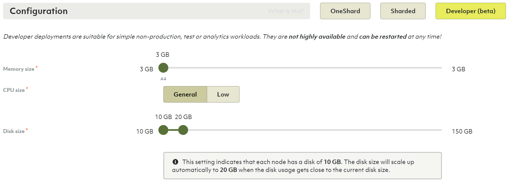
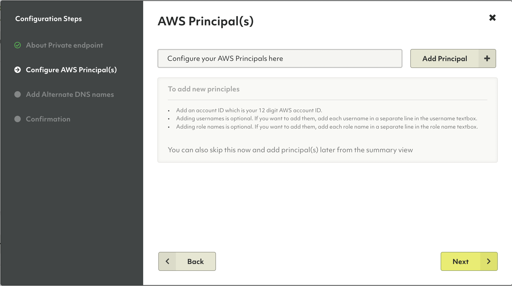

# Deployments

Below projects in the Oasis deployment hierarchy are deployments. A deployment
contains an ArangoDB, configured as you choose. You can have any number of
deployments under one project.

**Organizations → Projects → <u>Deployments</u>**

Each deployment can also be backed up manually or automatically by schedules
you can define.

In essence, you can create whatever structure fits you for a given organization,
its projects and deployments.

Also see the video
[Create a Deployment on ArangoDB Oasis](https://www.youtube.com/watch?v=yg2FfcNsKFc&list=PL0tn-TSss6NWH3DNyF96Zbz8LQ0OaFmvS&index=9&t=0s){:target="_blank"}.

## How to create a new deployment

1. If you do not have a project yet,
   [create a project](projects.html#how-to-create-a-new-project) first.
2. In the main navigation, in the __Projects__ section, click the project for
   which you want to create a new deployment.
3. In the __Deployments__ tab, you will see an empty list or a list with
   your project's existing deployments.
4. Click the __New deployment__ button.
5. Set up your deployment. The configuration options are described below.

Also see the video
[Create a Deployment on ArangoDB Oasis](https://www.youtube.com/watch?v=yg2FfcNsKFc&list=PL0tn-TSss6NWH3DNyF96Zbz8LQ0OaFmvS&index=9&t=0s){:target="_blank"}.


Deployments contain exactly **one policy**. Within that policy, you can define
role bindings to regulate access control on a deployment level.


### In the __General__ section

- Enter the name and optionally a short description for the deployment.

### In the __Location__ section

1. Select the __Provider__ and __Region__ of the provider.
   
   Once a deployment has been created, it is not possible to change the
   provider and region anymore.
   
2. Select the __DB Version__.
   **Note**: If you don't know which DB version to select, leave the version
   selected by default.
3. In the __CA Certificate__ field
    - The default certificate created for your project will automatically be selected.
    - If you have no default certificate, or want to use a new certificate
      create a new certificate by typing the desired name for it and hitting
      enter or clicking the name when done.
    - Or, if you already have multiple certificates, select the desired one.
4. _Optional but strongly recommended:_ In the __IP allowlist__ field, select the
   desired one in case you want to limit access to your deployment to certain
   IP ranges. To create a allowlist, navigate to your project and select the
   __IP allowlists__ tab (also see the video
   [IP allowlists with ArangoDB Oasis](https://www.youtube.com/watch?v=Et6nlTHBI50&list=PL0tn-TSss6NWH3DNyF96Zbz8LQ0OaFmvS&index=6&t=0s){:target="_blank"}).


For any kind of production deployment we strongly advise to use an IP allowlist.


### In the __Configuration__ section

Choose between a **OneShard**, **Sharded** or **Developer** deployment.

- OneShard deployments are suitable when your data set fits in a single node.
  They are ideal for graph use cases.

- Sharded deployments are suitable when your data set is larger than a single
  node. The data will be sharded across multiple nodes.

- Developer deployments are suitable when you want to try out ArangoDB without
  the need for high availability or scalability. The deployment will contain a
  single server only. Your data will not be replicated and your deployment can
  be restarted at any time.

#### OneShard

1. Select the memory size of your node.
2. Select the CPU size of your node.
3. Select the initial disk size of your node. The available ranges for the disk size
   depend on the selected memory size.
4. Select the upper limit for the disk size. It defaults to twice the initial
   disk size. You can set it to the same value as the initial disk size to
   disable automatic disk sizing.


A deployment's node disk size is automatically increased by 25% when the maximal
disk usage of a node exceeds 75% of its capacity, up to the configured limit.
You will be notified via email when the disk size is increased, as well as when
your deployment runs out of disk space but cannot be resized because it reached
the upper disk size limit already.


#### Sharded

- In addition to memory and disk size as in the OneShard configuration, select
  the number of nodes for your deployment. The more nodes you have, the higher
  the replication factor can be.

#### Developer

- Like with OneShard and Sharded deployments, you choose memory and disk size.
  However note that the sizes you choose are for the entire deployment.
  For OneShard and Sharded deployments the chosen sizes are per node.

### In the __Summary__ section

1. Review the configuration, and if you're ok with the setup press the
  __Create__ button.
2. You will be taken to the deployment overview page.
   **Note:** Your deployment is at that point being bootstrapped, this process
   will take a few minutes. Once it is ready, you will receive a confirmation email.

## How to access your deployment

1. In the main navigation, in the __Projects__ section, click the project for
   which you created a deployment earlier.
2. Navigate to the __Deployments__ tab.
3. For each deployment in your project, you see the status. While your new
   deployment is being set up, it will display the __bootstrapping__ status.
4. Press the __View__ button to show the deployment page.
5. When a deployment displays a status of __OK__, you can access it.
6. Click the copy icon next to the root password. This will copy the deployment
   root password to your clipboard. You can also click the view icon to unmask
   the root password to see it.

   
   Do not use the root username/password for everyday operations. It is recommended
   to use them only to create other user accounts with appropriate permissions.
   

7. You will also receive an email that the deployment is available, with a URL
   to open it up.
8. Click the __Open endpoint__ button or on the endpoint URL property to open
   the dashboard of your new ArangoDB deployment.
9. In the __username__ field type `root`, and in the __password__ field paste the
   password that you copied earlier.
10. Press the __Login__ button.
11. Press the __Select DB: \_system__ button

At this point your ArangoDB deployment is available for you to use — **Have fun!**


Each deployment is accessible on two ports:

- Port 8529 is the standard port recommended for use by web-browsers.
- Port 18529 is the alternate port that is recommended for use by automated services.

The difference between these ports is the certificate used. If you enable
__Use well known certificate__, the certificates used on port 8529 is well known
and automatically accepted by most web browsers. The certificate used on port
18529 is a self-signed certificate. For securing automated services, the use of
a self-signed certificate is recommended.


## How to enable the root user password rotation

Password rotation refers to changing passwords regularly - a security best practice
to reduce the vulnerability to password-based attacks and exploits by limiting
for how long passwords are valid. ArangoDB Oasis can automatically change the
`root` user password of an ArangoDB deployment periodically to improve security.

1. Navigate to the __Deployment__ for which you want to enable an automatic
   password rotation for the root user.
2. On the __Overview__ tab, click the button with the __gear__ icon next to the
   __ROOT PASSWORD__.
3. In the __Password Settings__ dialog, turn the password rotation on and click the
   __Confirm__ button.

   
4. You can expand the __Root password__ panel to see when the password was
   rotated last. The rotation takes place every three months.

## How to edit a deployment

You can modify a deployment’s configuration, including the ArangoDB version
that is being used, change the memory, CPU, and disk size, or even switch from
a OneShard deployment to a Sharded one if your data set no longer fits in a
single node. 


To edit an existing deployment, you must have the necessary set of permissions
attached to your role. Read more about [roles and permissions](access-control.html#roles).



The configuration options depend on the tier your organization belongs to.
For more details about available resources and usage limits, refer to the 
[Oasis tiers](organizations.html#oasis-tiers) section.


1. Go to the **Projects** section and select an existing deployment from the list. 
2. Open the deployment you want to change. 
3. On the **Overview** tab, click the **Edit** button. 
4. In the **Version and Security** section, you can do the following:
   - Modify the DB version that is currently being used.
   - Select a different CA certificate.
   - Add or remove an IP allowlist.
5. In the **Configuration** section, you can do the following:
   - Upgrade the memory size per node. 
   - Modify the CPU per node from General to Low or vice-versa, if made available
   by the cloud provider.
   - Select a different disk size per node. The available ranges for the disk size
   depend on the selected memory size. To enable automatic disk size scaling, move
   the slider to a value higher than the current disk size.
   - Change **OneShard** deployments into **Sharded** deployments. To do so,
   click **Sharded**. In addition to the other configuration options, you can
   select the number of nodes for your deployment. This can also be modified later on.

   
   Notice that you cannot switch from **Sharded** back to **OneShard**.
   
   
	- AWS deployments have an additional option that allows you to select the
   **Disk Performance** either with general settings, or optimised for large
   and very large data sets. This option is dependent on the selected memory
   size. For example, larger deployments have optimised settings by default.

   
   When upgrading the memory size, disk size, and/or disk performance in AWS deployments,
   the value gets locked and cannot be changed until the cloud provider rate limit is reset.  
   
	
6. All changes are reflected in the **Summary** section. Review the new
   configuration and click **Save**. 

## How to create a private endpoint deployment

To isolate your deployments and increase security, you can use the private endpoint feature.
Follow the steps outlined below to get started.


The private endpoint feature is only available on the
[Enterprise tier](organizations.html#oasis-tiers) of ArangoDB Cloud.



Private endpoints on Microsoft Azure can be cross region; in AWS they should be located in the same region.


### Google Cloud Platform

Google Cloud Platform (GCP) offers a feature called
[Private Service Connect](https://cloud.google.com/vpc/docs/private-service-connect){:target="_blank"}
that allows private consumption of services across VPC networks that belong to different groups, teams, projects, or organizations. 
You can publish and consume services using the defined IP addresses which are internal to your VPC network.

In ArangoDB Cloud, you can
[create a regular deployment](#how-to-create-a-new-deployment) and change it
to a private endpoint deployment afterwards.

Such a deployment will not be reachable from the internet anymore, other than via
the ArangoDB Cloud dashboard to administrate it. To revert to a public deployment, please
contact support via **Request help** in the help menu.

To configure a private endpoint for GCP, you need to provide your Google project names. ArangoDB Cloud then
configures a Private Endpoint Service that will automatically connect to Private Endpoints that are created for those projects.

After creation of the Private Endpoint Service, you will receive a service attachment 
that you need during the creation of your Private Endpoint(s).

1. Open the deployment you want to change.
2. On the **Overview** tab, click the **Edit** button with an ellipsis (`…`)
   icon. If you see a pencil icon and no menu opens, then you are on the
   free-to-try or professional tier. The private endpoint service is only available on the enterprise tier.
3. Click **Change to private endpoint** in the menu.
   
4. In the configuration wizard, click **Next** to enter your configuration details.
5. Enter one or more Google project names. You can also add them later in the summary view.
   Click **Next**.
   
6. Enter one or more alternate DNS names. This step is optional.
   Continue with or without alternate DNS names entered by clicking **Next**.
   The names can be changed later.
7. Click **Confirm Settings** to change the deployment.
8. Back on the **Overview** tab, scroll down to the **Private Endpoint** section
   that is now displayed to see the connection status and to change the
   configuration.
9. ArangoDB Cloud will configure a Private Endpoint Service. As soon as as the **Service Attachment** is ready,
   you can use it to configure the Private Service Connect in your VPC.


When you create a private endpoint on ArangoDB Cloud, both endpoints (the regular one and the new private one) are available
for two hours. During this time period, you can switch your application to the new private endpoint. After this period, the old
endpoint will not be available anymore.


### Microsoft Azure

Microsoft Azure offers a feature called
[Azure Private Link](https://docs.microsoft.com/en-us/azure/private-link){:target="_blank"}
that allows you to limit communication between different Azure servers and
services to Microsoft's backbone network without exposure to the internet.
It can lower network latency and increase security.

If you want to connect an ArangoDB Oasis deployment running on Azure with other
services you run on Azure using such a tunnel, then
[create a regular deployment](#how-to-create-a-new-deployment) and change it
to a private endpoint deployment afterwards.

The deployment will not be reachable from the internet anymore, other than via
the Oasis dashboard to administrate it. To revert to a public deployment, please
contact support via **Request help** in the help menu.

1. Open the deployment you want to change.
2. On the **Overview** tab, click the **Edit** button with an ellipsis (`…`)
   icon. If you see a pencil icon and no menu opens, then you are on the
   free-to-try or professional tier. The private endpoint service is only available on the enterprise tier.
3. Click **Change to private endpoint** in the menu.
   
4. In the configuration wizard, click **Next** to enter your configuration details.
5. Enter one or more Azure Subscription IDs (GUIDs). They cannot be
   changed anymore once a connection has been established.
   Proceed by clicking **Next**.
   
6. Enter one or more Alternate DNS names. This step is optional.
   Continue with or without Alternate DNS names entered by clicking **Next**.
   They can be changed later.
7. Click **Confirm Settings** to change the deployment.
8. Back on the **Overview** tab, scroll down to the **Private Endpoint** section
   that is now displayed to see the connection status and to change the
   configuration.
9. ArangoDB Cloud will configure a Private Endpoint Service. As soon as the **Azure alias**
   becomes available, you can copy it and then go to your Microsoft Azure portal
   to create Private Endpoints using this alias. The number of established
   **Connections** will increase and you can view the connection details by
   clicking it.


When you create a private endpoint on ArangoDB Cloud, both endpoints (the old one and the new private one) are available
for two hours. During this time period, you can switch your application to the new private endpoint. After this period, the old
endpoint will not be available anymore.


### Amazon Web Services (AWS)

AWS offers a feature called [AWS PrivateLink](https://aws.amazon.com/privatelink){:target="_blank"}
that enables you to privately connect your Virtual Private Cloud (VPC) to
services, without exposure to the internet. You can control the specific API
endpoints, sites, and services that are reachable from your VPC.

Amazon VPC allows you to launch AWS resources into a
virtual network that you have defined. It closely resembles a traditional
network that you would normally operate, with the benefits of using the AWS
scalable infrastructure. 

In ArangoDB Cloud, you can
[create a regular deployment](#how-to-create-a-new-deployment) and change it
to a private endpoint deployment afterwards.

The ArangoDB private endpoint deployment will not be exposed to public internet anymore, other than via
the Oasis dashboard to administrate it. To revert it to a public deployment,
please contact the support team via __Request help__ in the help menu.

To configure a private endpoint for AWS, you need to provide the AWS principals related
to your VPC. The ArangoDB Oasis platform configures a private endpoint service
that automatically connects to private endpoints that are created in those principals. 

1. Open the deployment you want to change.
2. In the **Overview** tab, click the **Edit** button with an ellipsis (`…`)
   icon. If you see a pencil icon and no menu opens, then you are on the
   free-to-try or professional tier. The private endpoint service is only available on the enterprise tier.
3. Click **Change to private endpoint** in the menu.
   
4. In the configuration wizard, click **Next** to enter your configuration details.
5. Click **Add Principal** to start configuring the AWS principal(s). 
   You need to enter a valid account, which is your 12 digit AWS account ID.
   Adding usernames or role names is optional. You can also
   skip this step and add them later from the summary view.
   
   Principals cannot be changed anymore once a connection has been established.
   
   
6. Enter one or more Alternate DNS names. This step is optional, you can 
   add or change them later. Click **Next** to continue.
   
7. Confirm that you want to use a private endpoint for your deployment by
   clicking **Confirm Settings**.
8. Back in the **Overview** tab, scroll down to the **Private Endpoint** section
   that is now displayed to see the connection status and change the
   configuration, if needed.
   
   
   To learn more or request help from the Oasis support team, click **Help**
   in the top right corner of the **Private Endpoint** section.
   
9. ArangoDB Cloud will configure a private endpoint service. As soon as this is available,
   you can use it in the AWS portal to create an interface endpoint to connect
   to your endpoint service. For more details, see
   [How to connect to an endpoint](https://docs.aws.amazon.com/vpc/latest/privatelink/create-endpoint-service.html#share-endpoint-service){:target="_blank"}.


When you create a private endpoint on ArangoDB Cloud, both endpoints (the old one and the new private one) are available
for two hours. During this time period, you can switch your application to the new private endpoint. After this period, the old
endpoint will not be available anymore.


## How to delete a deployment


Deleting a deployment will delete all its data and backups.
This operation is **irreversible**. Please proceed with caution.


1. In the main navigation, in the __Projects__ section, click the project that
   holds the deployment you wish to delete.
2. On the __Deployments__ tab, click the deployment you wish to delete.
3. Click the __Danger zone__ tab.
4. Click the __Delete deployment__ button.
5. In the modal dialog, confirm the deletion by entering `Delete!` into the
   designated text field.
6. Confirm the deletion by pressing the __Yes__ button.
7. You will be taken back to the deployments page of the project.
   The deployment being deleted will display the __Deleting__ status until it has
   been successfully removed.
