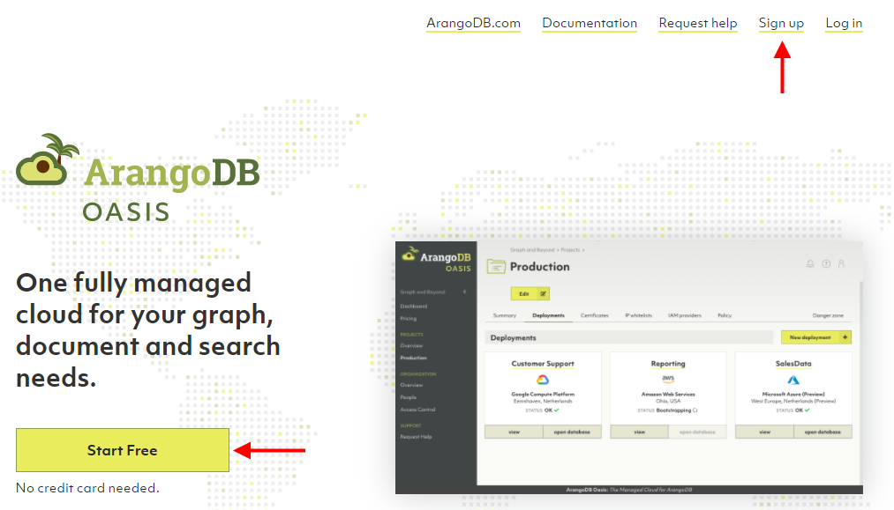
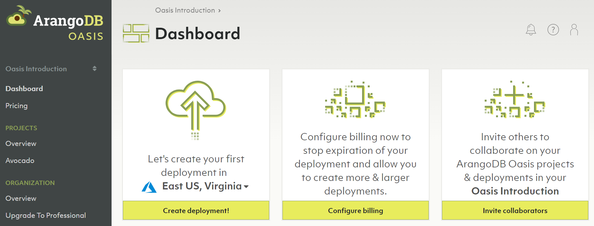
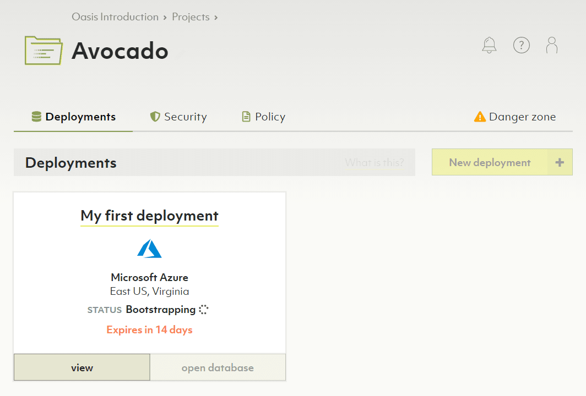
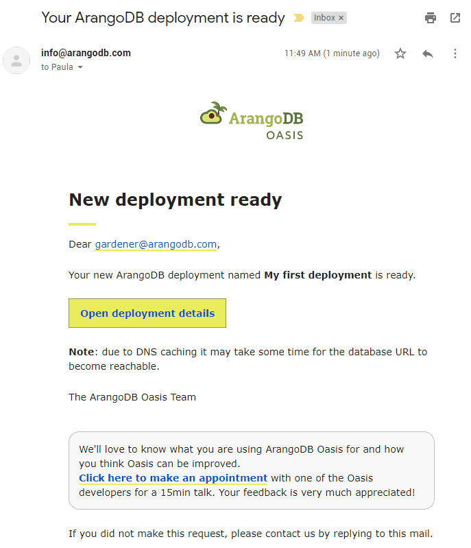
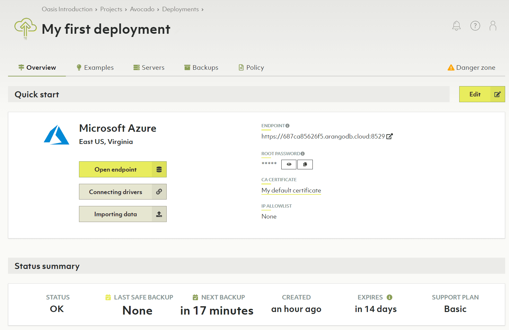
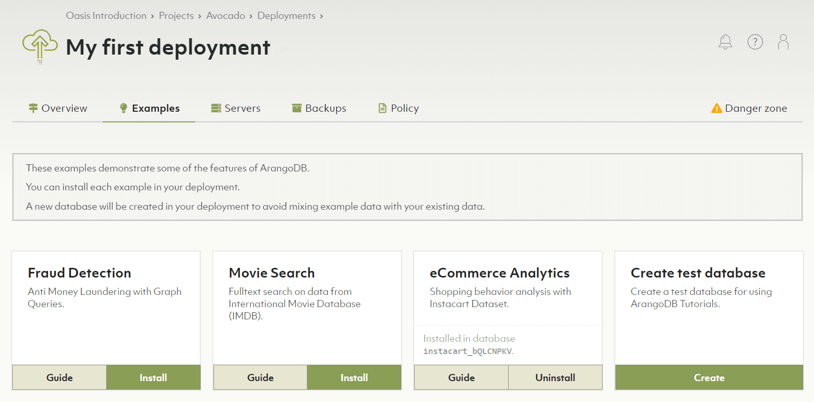
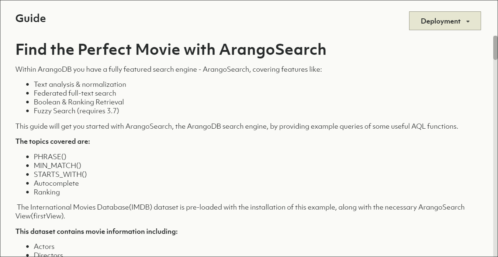

# Getting Started with ArangoDB Oasis

This quick start guide covers the basics from creating an account to setting up
and accessing your first ArangoDB deployment in Oasis.

For general information about ArangoDB Oasis, see
[cloud.arangodb.com](https://cloud.arangodb.com/home?utm_source=docs&utm_medium=cluster_pages&utm_campaign=docs_traffic){:target="_blank"}.

A video series on how to get started with Oasis is also available:



## Prerequisites

Please have following information at hand for registration:

- An **email address**, required for email verification.

If you use a public email service provider (e.g. Hotmail), make sure to have
the following information at hand as well:

- A **mobile phone number**, required for SMS verification


One mobile phone number will be associated with one account and cannot be
used for multiple accounts.


## How to create a new account

1. Go to [cloud.arangodb.com](https://cloud.arangodb.com/home?utm_source=docs&utm_medium=cluster_pages&utm_campaign=docs_traffic){:target="_blank"}.
2. Click the _Start Free_ button or click the _Sign Up_ link in the top
   right corner.

   

3. Review the terms & conditions and privacy policy and click _I accept_.
4. Select the type of sign up you would like to use (GitHub, Google, or
   email address).
     - For GitHub or Google please follow on-screen instructions.
     - For the email address option, type your desired email address in the
       email field and type a strong password in the password field.

     {:style="max-height: 50vh"}

   Click the _Sign up_ button. You will receive a verification email. In that
   mail, click the _Verify my email address_ link or button.
   It will open a page in ArangoDB Oasis that says _Welcome back!_
5. Click the _Log in_ button to continue and login.
6. If you signed up with an email address of a public email service provider (e.g. Hotmail),
   a form appears asking for your mobile phone number. Enter the country code
   and the number of the mobile phone you want to use for this account.
   For company email addresses, this step is skipped.
7. If you had to enter your phone number in the previous step, a verification
   code will be sent via SMS to the mobile number you entered. Enter the
   verification code.
8. A form will appear asking for your name. Enter your first, last and company
   name, and then press the _Save_ button.
9. An organization with a default project will now be prepared for you.
   Once that is completed, you will be redirected to the
   [ArangoDB Oasis dashboard](https://cloud.arangodb.com/dashboard){:target="_blank"}.

## Get a deployment up and running

1. The first card in the Oasis Dashboard has a dropdown menu to select a cloud
   provider and region. Pick one, click on _Create deployment_ and accept the
   terms and conditions.

   

   You can also [create a deployment](deployments.html#how-to-create-a-new-deployment)
   manually if you want fine-grained configuration options.
2. The new deployment will show up in the list of deployments for the 
   respective project (here: _Avocado_).

   

   It takes a couple of minutes before the deployment can be used. The status
   will change from _Bootstrapping_ to _OK_ eventually and you will also
   receive an email when it is ready.

   {:style="max-height: 50vh"}

3. Click on the name or the _View_ button of the deployment card (or the
   _Open deployment details_ link in the email) to get to the deployment
   details.

   

4. You can copy the ArangoDB password for the root user by clicking the second
   button below the label _ROOT PASSWORD_. Then click on the _Open endpoint_
   button to bring up the ArangoDB web interface. Enter the credentials
   (user `root` and its password) and log in.

5. You can install example datasets and follow the accompanying guides to get
   started with ArangoDB and its query language. In the Oasis dashboard, click
   on the _Examples_ tab of the deployment. Click on _Install_ of one of the
   examples to let Oasis create a separate database and import the dataset.
   Click on _Guide_ for instructions on how to access and run queries against
   this data.

   

   

## Free-to-try vs. professional service

ArangoDB Oasis comes with a free-to-try tier that lets you test our ArangoDB
Cloud for free for 14 days. It includes one project and one deployment.
After the trial period, your deployments will automatically be deleted.

You can convert to the professional service model at any time by adding 
your billing details and at least one payment method. See:
- [How to add billing details to organizations](billing.html#how-to-add-billing-details)
- [How to add a payment method to an organization](billing.html#how-to-add-a-payment-method)

## Limitations of ArangoDB Oasis

ArangoDB Oasis aims to make all features of the ArangoDB Enterprise Edition
available to you, but there are a few limitations:

1. Encryption (both at rest & network traffic) is always on and cannot be
   disabled for security reasons.
2. Foxx services are not allowed to call out to the internet for security
   reasons. Incoming calls to Foxx services are fully supported.
3. LDAP authentication & Audit trails are currently unavailable, but will be
   supported in the near future.
