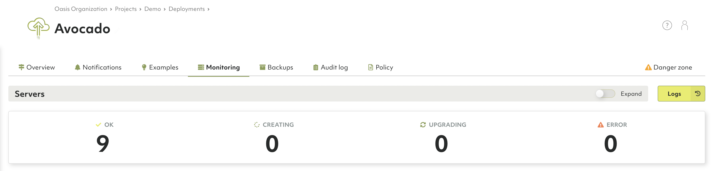
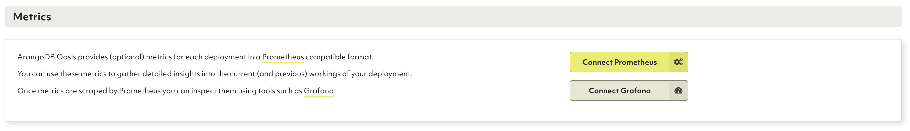
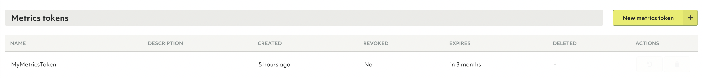

# Monitoring & Metrics

ArangoDB Oasis provides metrics for each deployment in a 
[Prometheus](https://prometheus.io/){:target="_blank"}
compatible format.
You can use these metrics to gather detailed insights into the current
and previous workings of your deployment.
Once metrics are scraped by Prometheus, you can inspect them using tools
such as [Grafana](https://grafana.com/oss/grafana/){:target="_blank"}.

To get started, select an existing deployment from within a project and
open the **Monitoring** tab. 





## Metrics tokens

The **Metrics tokens** section allows you to create a new metrics token,
which is necessary when connecting to Prometheus.

1. To create a metrics token, click **New metrics token**.
2. For **Name**, enter a name for the metrics token.
3. Optionally, you can also enter a **Short description**.
4. Select the **Lifetime** of the metrics token. 
5. Click **Create**.



## How to connect Prometheus

1. In the **Metrics** section, click **Connect Prometheus**.
2. Create a `prometheus.yml` file and add the following content:

    ```yml
    global:
    scrape_interval: 60s
    scrape_configs:
    - job_name: 'deployment'
        bearer_token: '<fill-your-metrics-token-here>'
        scheme: 'https'
        static_configs:
        - targets: ['6775e7d48152.arangodb.cloud:8829']
        tls_config:
        insecure_skip_verify: true
    ```
3. Start Prometheus with the following command:

    ```dockerfile
    docker run -d \
    -p 9090:9090 -p 3000:3000 --name prometheus \
    -v $(pwd)/prometheus.yml:/etc/prometheus/prometheus.yml:ro \
    prom/prometheus
    ```
    
    This command also opens a port 3000 for Grafana. In a production setting,
    this is not needed nor recommended.
    

## How to connect Grafana

1. Start Grafana with the following command:

    ```dockerfile    
    docker run -d \
    --network container:prometheus \
    grafana/grafana
    ```  
2. Go to `localhost:3000` and login with the following credentials:
   - For username, enter *admin*.
   - For password, enter *admin*. 

   After the initial login, make sure to change your password.
3. To add a data source, click **Add your first data source** and then do the following:
   - Select **Prometheus**.
   - For **HTTP URL**, enter `http://localhost:9090`.
   - Click **Save & Test**.      
4. To add a dashboard, open the menu and click **Create** and then **Import**.
5. Download the [Grafana dashboard for ArangoDB Oasis](https://github.com/arangodb-managed/grafana-dashboards){:target="_blank"}.
6. Copy the content of the `main.json` file into **Import via panel json** field in Grafana.
7. Click **Load**.