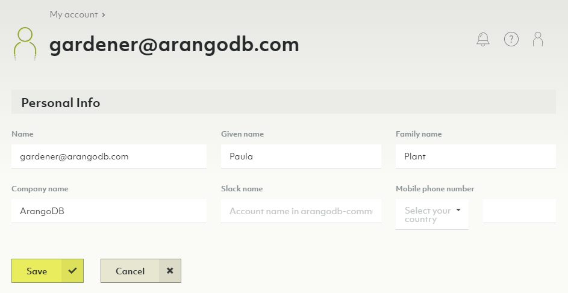
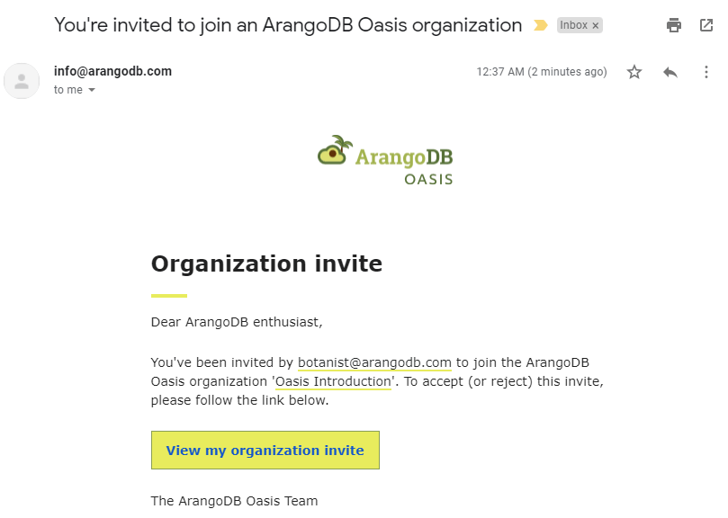
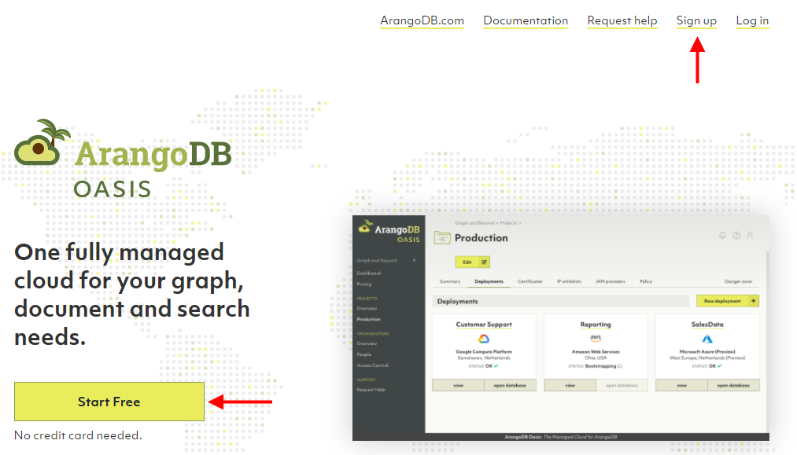
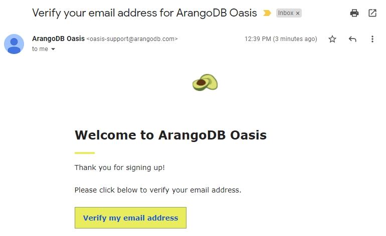
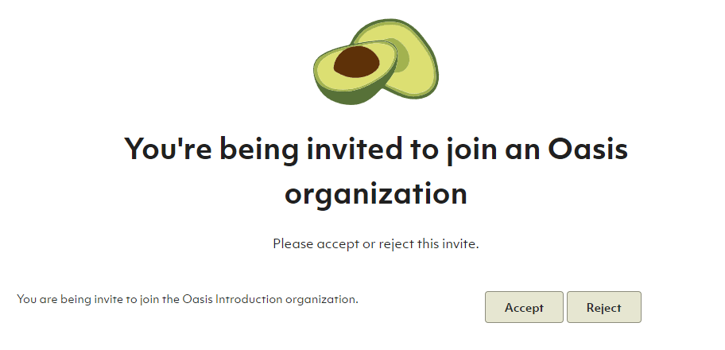
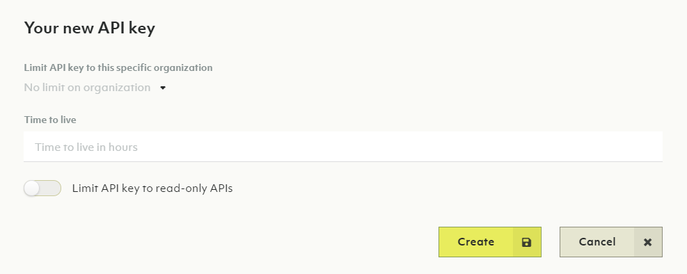

# My Account

You can access information related to your account via the _User Toolbar_.
The toolbar is in the top right corner in the Oasis dashboard and
accessible from every view. There are two elements:

- __Question mark icon__: Help
- __User icon__: My Account

## Overview

### How to view my account

1. Hover or click the user icon of the _User Toolbar_ in the top right corner.
2. Click on _Overview_ in the _My account_ section.
3. The _Overview_ displays your name, email address, company and when the
   account was created.

### How to edit the profile of my account

1. Hover or click the user icon in the _User Toolbar_ in the top right corner.
2. Click on _Overview_ in the _My account_ section.
3. Click the _Edit_ button.
4. Change your personal information and click on _Save_.

## Organizations

### How to view my organizations

1. Hover or click the user icon of the _User Toolbar_ in the top right corner.
2. Click on _My organizations_ in the _My account_ section.
3. Your organizations are listed in a table.
   Click on the organization name or the eye icon in the _Actions_ column to
   jump to the organization overview.

### How to create a new organization

1. Hover or click the user icon of the _User Toolbar_ in the top right corner.
2. Click on _My organizations_ in the _My account_ section.
3. Click on the _New organization_ button.
4. Enter a name and and a description for the new organization and click the
   _Create_ button.


The free to try tier is limited to a single organization.


### How to delete an organization


Removing an organization implies the deletion of projects and deployments.
This operation cannot be undone and **all deployment data will be lost**.
Please proceed with caution.


1. Hover or click the user icon of the _User Toolbar_ in the top right corner.
2. Click on _My organizations_ in the _My account_ section.
3. Click on the trash can icon in the _Actions_ column.
4. Enter `Delete!` to confirm and click on _Yes_.


If you are no longer a member of any organization, then a new organization is
created for you when you log in again.


## Invites

Invitations are requests to join organizations. You can accept or reject
pending invites.

### How to create invites

See [Users and Groups: How to add a new member to the organization](users.html#how-to-add-a-new-member-to-the-organization)

### How to respond to my invites

#### I am not a member of an organization yet

1. Once invited, you will receive an email asking to join your
   ArangoDB Oasis organization.
   
2. Click the __View my organization invite__ link in the email. You will be
   asked to log in or to create a new account.
3. To sign up for a new account, click the __Start Free__ button or the
   __Sign up__ link in the header navigation.
   
4. After successfully signing up, you will receive a verification email.
5. Click the __Verify my email address__ link in the email. It takes you back
   to the ArangoDB Oasis site.
   
6. After successfully logging in, you can accept or reject the invite to
   join your organization.
   
7. After accepting the invite, you become a member of your organization and
   will be granted access to the organization and its related projects and
   deployments.

#### I am already a member of an organization

1. Once invited, you will receive an email asking to join your
   ArangoDB Oasis organization, as well as a notification in the Oasis dashboard.
2. Click the __View my organization invites__ link in the email, or hover over the
   user icon in the top right corner of the dashboard and click
   __My organization invites__.
   
3. On the __Invites__ tab of the __My account__ view, you can accept or reject
   pending invitations, as well as see past invitations that you accepted or
   rejected. Click the button with a checkmark icon to join the organization.
   

## API Keys

API keys are authentication tokens intended to be used for scripting.
They allow a script to authenticate on behalf of a user.

An API key consists of a key and a secret. You need both to complete
authentication.

### How to view my API keys

1. Hover or click the user icon of the _User Toolbar_ in the top right corner.
2. Click on _My API keys_ in the _My account_ section.
3. Information about the API keys are listed in the _My API keys_ section.

### How to create a new API key

1. Hover or click the user icon of the _User Toolbar_ in the top right corner.
2. Click on _My API keys_ in the _My account_ section.
3. Click the _New API key_ button.
4. Optionally limit the API key to a specific organization.
5. Optionally specify after how many hours the API key should expire into the
   _Time to live_ field.
6. Optionally limit the API key to read-only APIs
7. Click on the _Create_ button.
8. Copy the API key ID and Secret, then click the _Close_ button.


The secret is only shown once at creation time.
You have to store it in a safe place.


### How to revoke or delete an API key

1. Hover or click the user icon of the _User Toolbar_ in the top right corner.
2. Click on _My API keys_ in the _My account_ section.
3. Click on an icon in the _Actions_ column:
   - _Counter-clockwise arrow icon_: Revoke API key
   - _Trash can icon_: Delete API key
4. Click the _Yes_ button to confirm.


TODO: Copy to clipboard button
Access token that should expire after 1 hour unless renewed, might get removed as it's confusing.

