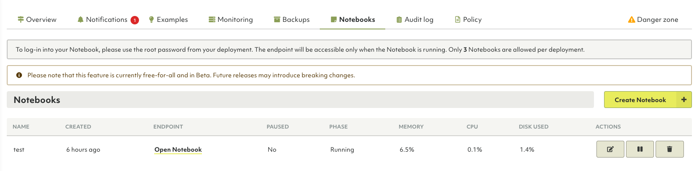

# Notebooks

{{ page.description }}
{:class="lead"}

ArangoDB Oasis provides an easy way to run Jupyter Notebooks in the cloud with
full GPU support.

This feature allows you to:

- Perform data exploration within the platform, without having to download it
to your local environment.
- Control computing resources (GPU, CPU, memory, and disk size) and get a 
transparent understanding of usage from your development environment.
- Use the integrated notebook interface to work with ArangoDB's Graph AI 
Platform, Python and ML libraries.

## How to create a new notebook

1. Navigate to the **Deployments** tab.
2. Open the deployment in which you want to create the notebook.
3. Go to the **Notebooks** tab and click the **Create Notebook** button.
You can only create three notebooks per deployment.
4. Enter a name and optionally a description for your new notebook. Click **Save**.
5. The notebook's phase is set to **Initializing**. Once the phase changes to
**Running**, the notebook's endpoint will be accessible.
1. Click the **Open notebook** button to access your notebook. 
2. To login into your notebook, use the `root` password from your deployment.


Notebooks have a fixed configuration with 10 GiB of Disk size.


## How to edit a notebook

1. Select the notebook that you want to change from the **Notebooks** tab.
2. Click **Edit notebook**. You can modify its name and description.
3. To pause a notebook, click the **Pause notebook** button. You can resume it
at anytime. The notebook's phase is updated accordingly.

## How to delete a notebook

1. Select the notebook that you want to remove from the **Notebooks** tab.
2. Click the **Delete notebook** button.