# Getting Started with the Oasis API and Oasisctl

Oasisctl is a command line tool for accessing the Oasis API. This tutorial will
guide you through the Oasis API as well as Oasisctl and show you how to:

- Generate an API key and authenticate with Oasisctl
- View information related to your organizations, projects, and deployments
- Configure, create and delete a deployment

With Oasisctl the general command structure is to execute commands such as:

```
oasisctl list deployments
```

This command lists all deployments available to the authenticated user and we
will explore it in more detail later. Most commands also have associated
`--flags` that are required or provide additional options, this aligns with the
interaction method for many command line utilities. If you aren’t already
familiar with this, follow along as there are many examples in this guide that
will familiarize you with this command structure and using flags, along with
how to use OasisCtl to access the Oasis API.

Note: A good rule of thumb for all variables, resource names, and identifiers
is to **assume they are all case sensitive**, when being used with Oasisctl.

## API Authentication

### Generating an API Key

The first step to using the Oasis API is to generate an API key. To generate a
key you will need to be signed into your account at
[cloud.arangodb.com](https://cloud.arangodb.com/home?utm_source=docs&utm_medium=cluster_pages&utm_campaign=docs_traffic){:target="_blank"}.
Once you are signed in, hover over the profile icon in the top right corner.

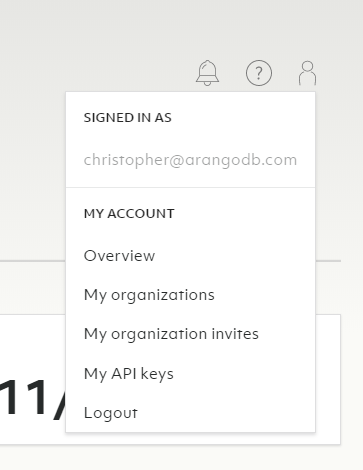

Click _My API keys_.

This will bring you to your API key management screen. From this screen you can
create, reject, and delete API keys.

Click the _New API key_ button.

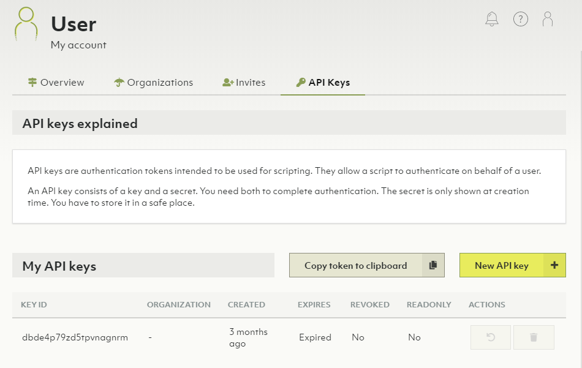

The pop-up box that follows has a few options for customizing the access level
of this API key.

The options you have available include:

- Limit access to 1 organization or all organizations this user has access to
- Set an expiration time, specified in number of hours
- Limit key to read-only access

Once you have configured the API key access options, you will be presented with
your API key ID and API key secret. It is very important that you capture the
API key secret before clicking the close button. There is no way to retrieve
the API key secret after closing this pop-up window.


Once you have securely stored your API key ID and secret, click close.

That is all there is to setting up API access to your ArangoDB Oasis
organizations.

### Authenticating with Oasisctl

Now that you have API access it is time to login with Oasisctl.

Running the Oasisctl utility without any arguments is the equivalent of
including the --help flag. This shows all of the top level commands available
and you can continue exploring each command by typing the command name
followed by the --help flag to see the options available for that command.

Let’s start with doing that for the login command:

```bash
oasisctl login --help
```

You should see an output similar to this:

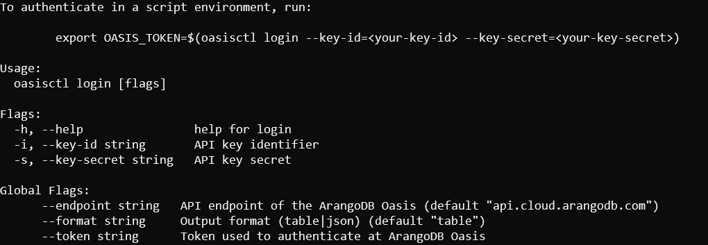

This shows two additional flags are available, aside from the help flag.

- `--key-id`
- `--key-secret`

These require the values we received when creating the API key. Once you run
this command you will receive an authentication token that can be used for the
remainder of the session.

```bash
oasisctl login \
  --key-id cncApiKeyId \
  --key-secret 873-secret-key-id
```

Upon successful login you should receive an authentication token:

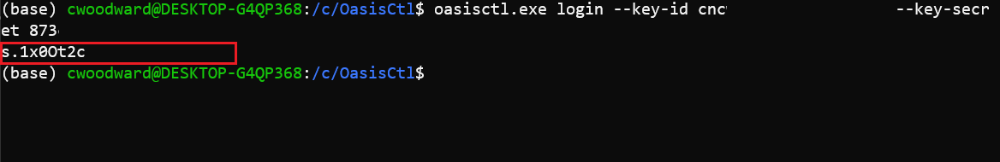

Depending on your environment, you could instead store this token for easier
access. For example:

With Linux:

```bash
export OASIS_TOKEN=$(oasisctl login --key-id cncApiKeyId --key-secret 873-secret-key-id)
```

Or Windows Powershell:

```powershell
setx OASIS_TOKEN (oasisctl login --key-id cncApiKeyId --key-secret 873-secret-key-id)
```

In the coming sections you will see how to authenticate with this token when
using other commands that require authentication.

## Viewing and Managing Organizations and Deployments

### Format

This section covers the basics of retrieving information from the Oasis API.
Depending on the data you are requesting from the Oasis API, being able to read
it in the command line can start to become difficult. To make text easier to
read for humans and your applications, Oasisctl offers two options for
formatting the data received:

- Table
- JSON

You can define the format of the data by supplying the `--format` flag along
with your preferred format, like so:

```bash
oasisctl --format json
```

### Viewing Information with the List Command

This section will cover the two main functions of retrieving data with the
Oasis API. These are:

- `list` - List resources
- `get` - Get information

Before you can jump right into making new deployments you need to be aware of
what resources you have available. This is where the list command comes in.
List serves as a way to retrieve general information, you can see all of the
available list options by accessing its help output.

```bash
oasisctl list --help
```

This should output a screen similar to:

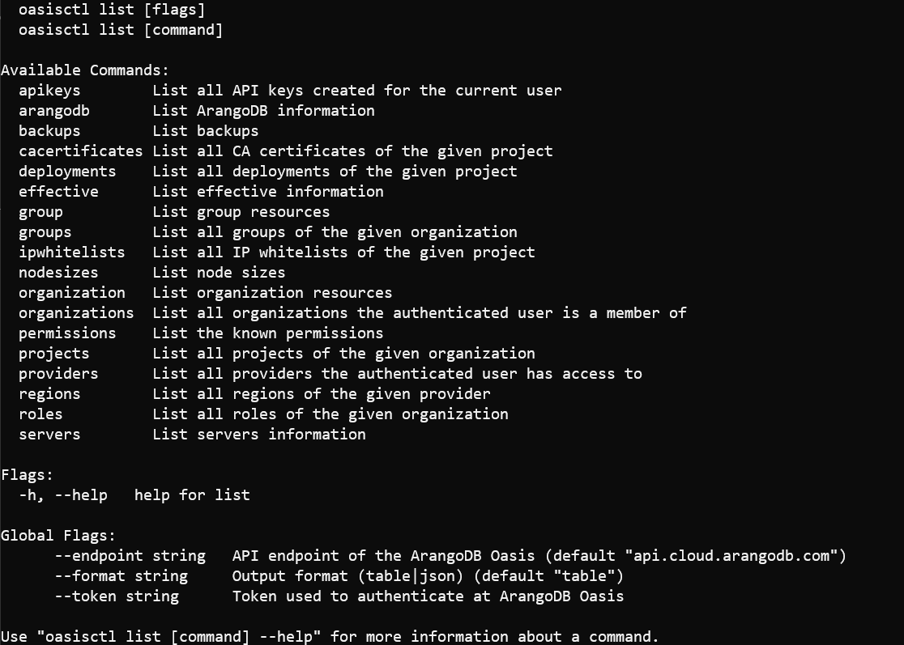

As you can see you can get information on anything you would need about your
Oasis organizations, deployments, and access control. To start, let’s take a
look at a few examples of listing information and then getting more details on
our results.

### List Organizations

One of the first pieces of information you may be interested in is the
organizations you have access to. This is useful to know because most commands
require an explicit declaration of the organization you are interacting with.
To find this, use list to list your available organizations:

```bash
oasisctl list organizations --format json
```

Once you have your available organizations you can refer to your desired
organization using its name or id.

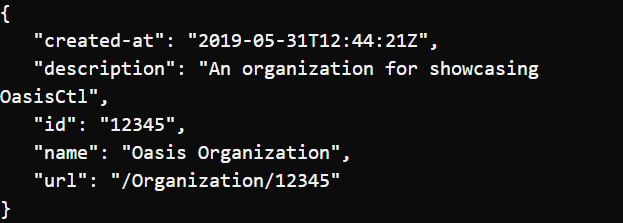

Note: You may also notice the url attribute, this is for internal use only and
should not be treated as a publicly accessible path.

### List Projects

Once you have the organization name that you wish to interact with, the next
step is to list the available projects within that organization. Do this by
following the same command structure as before and instead exchange
organizations for projects, this time providing the desired organization name
with the `--organization-id` flag.

```bash
oasisctl list projects \
  --organization-id "Oasis Organization" \
  --format json
```

This will return information on all projects that the authenticated user has
access to.

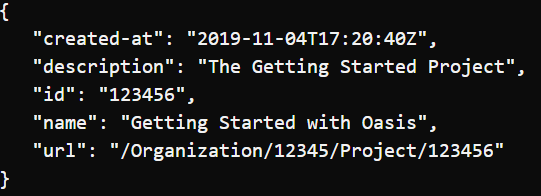

### List Deployments

Things start getting a bit more interesting with information related to
deployments. Now that you have obtained an organization iD and a project ID,
you can list all of the associated deployments for that project.

```bash
oasisctl list deployments \
  --organization-id "Oasis Organization" \
  --project-id "Getting Started with Oasis" \
  --format json
  ```

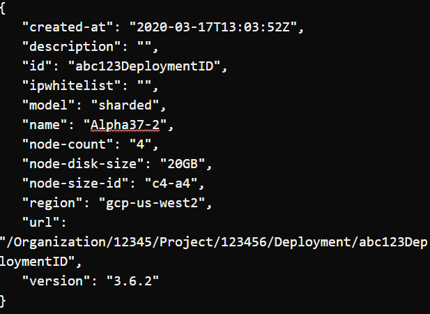

This provides some basic details for all of the deployments associated with the
project. Namely, it provides a deployment ID which we can use to start making
modifications to the deployment or to get more detailed information, with the
`get` command.

### Using the Get Command

In Oasisctl, you use the get command to obtain more detailed information about
any of your available resources. It follows the same command structure as the
previous commands but typically requires a bit more information. For example,
to get more information on a specific deployment means you need to know at
least:

- Organization ID
- Project ID
- Deployment ID

To get more information about our example deployment we would need to execute
the following command:

```bash
oasisctl get deployment \
  --organization-id "Oasis Organization" \
  --project-id "Getting Started with Oasis" \
  --deployment-id "abc123DeploymentID" \
  --format json
```

This returns quite a bit more information about the deployment including more
detailed server information, the endpoint url where you can access the Web UI,
and optionally the root user password.

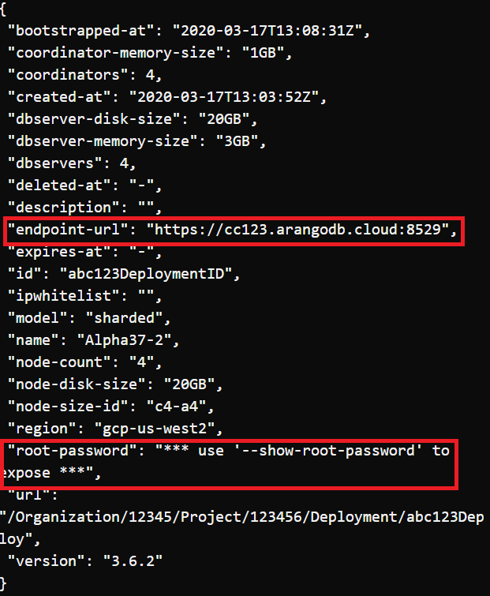

### Node Size ID

We won’t be exploring every flag available for creating a deployment but it is
a good idea to explore the concept of the node size ID value. This is an
indicator that is unique to each provider (Google, Azure, AWS) and indicates
the CPU and memory. Depending on the provider and region this can also
determine the available disk sizes for your deployment. In other words, it is
pretty important to know which `node-size-id` your deployment will be using.

The command you execute will determine on the available providers and regions
for your organization but here is an example command that lists the available
options in the US West region for the Google Compute Platform:

```bash
oasisctl list nodesizes \
  --organization-id "Oasis Organization" \
  --provider-id "Google Compute Platform" \
  --region-id gcp-us-west2
```

The output you will see will be similar to this:

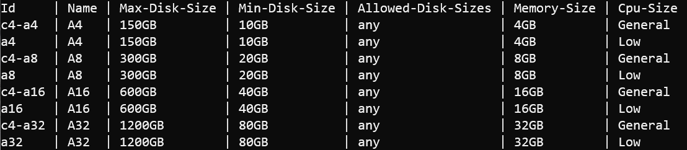

It is important to note that you can scale up with more disk size but you are
unable to scale down your deployment disk size. The only way to revert back to
a lower disk size is to destroy and recreate your deployment.

Once you have decided what your starting deployment needs are you can reference
your decision with the Id value for the corresponding configuration. So, for
our example, we will be choosing the c4-a4 configuration. The availability and
options are different for each provider and region, so be sure to confirm the
node size options before creating a new deployment.

### Challenge

You can use this combination of listing and getting to obtain all of the
information you want for your Oasis organizations. We only explored a few of
the commands available but you can explore them all within the utility by
utilizing the `--help` flag or you can see all of the available options
in the [documentation](oasisctl-options.html).

Something that might be useful practice before moving on is getting the rest
of the information that you need to create a deployment. Here are a list of
items that won’t have defaults available when you attempt to create your
first deployment and you will need to supply:

- CA Certificate ID (name)
- IP Allowlist ID (id) (optional)
- Node Size ID (id)
- Node Disk Size (GB disk size dependent on Node Size ID)
- Organization ID (name)
- Project ID (name)
- Region ID (name)

Try looking up that information to get more familiar with how to find
information with Oasisctl. When in doubt use the `--help` flag with any
command.

## Creating Resources

Now that you have seen how to obtain information about your available
resources, it’s time to start using those skills to start creating your own
deployment. To create resources with Oasisctl you use the create command.
To see all the possible options you can start with the following command:

```bash
oasisctl create --help
```

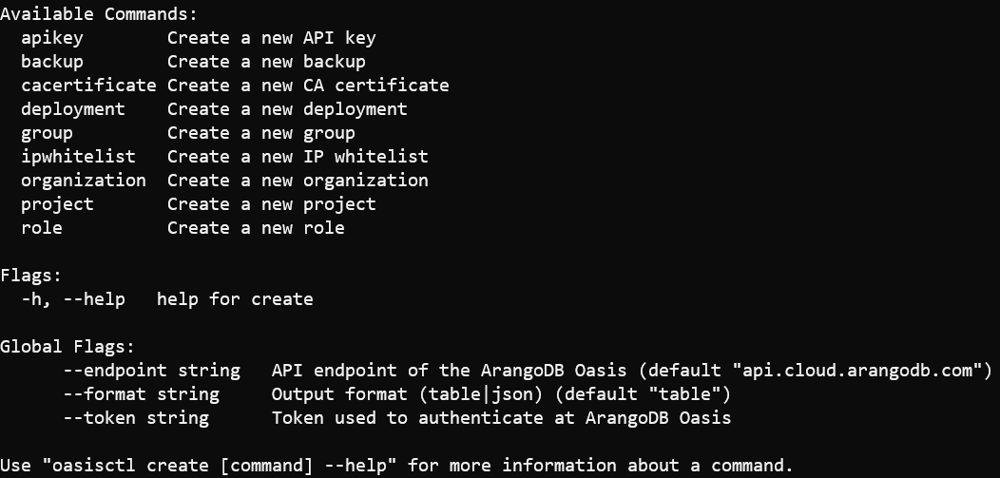

### Create a Deployment

To take a look at all of the options available when creating a deployment the
best place to start is with our trusty help command.

```bash
oasisctl create deployment --help
```

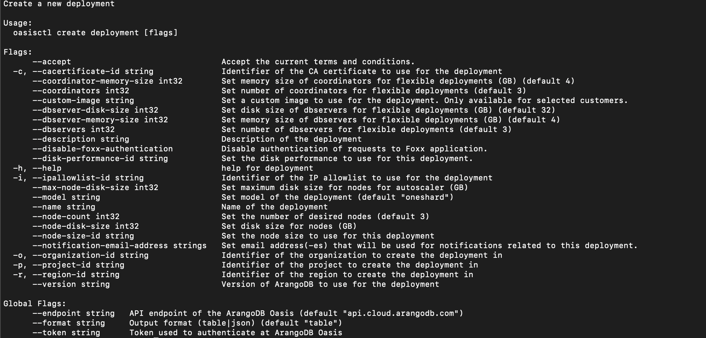

As you can see there are a lot of default options but also a few that require
some knowledge of our pre-existing resources. Attempting to create a deployment
without one of the required options will return an error indicating which value
is missing or invalid.

Once you have collected all of the necessary information the command for
creating a deployment is simply supplying the values along with the appropriate
flags. This command will create a deployment:

```bash
oasisctl create deployment \
  --region-id gcp-us-west2 \
  --node-size-id c4-a4 \
  --node-disk-size 10 \
  --version 3.6.2 \
  --cacertificate-id OasisCert \
  --organization-id "Oasis Organization" \
  --project-id "Getting Started with Oasis" \
  --name "First Oasisctl Deployment" \
  --description "The first deployment created using the awesome Oasisctl utility!"
```

If everything went according to play you should see similar output:

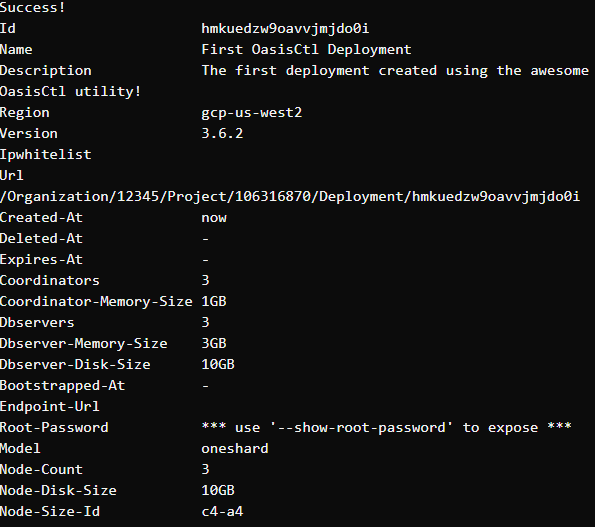

### Wait on Deployment Status

When you create a deployment it begins the process of _bootstrapping_ which is
getting the deployment ready for use. This should happen quickly and to see if
it is ready for use you can run the wait command using the ID of the newly
created deployment, shown at the top of the information you received above.

```bash
oasisctl wait deployment \
  --deployment-id hmkuedzw9oavvjmjdo0i
```

Once you receive a response of _Deployment Ready_, your deployment is indeed
ready to use. You can get some new details by running the get command.

```bash
oasisctl get deployment \
  --organization-id "Oasis Organization" \
  --deployment-id hmkuedzw9oavvjmjdo0i
```

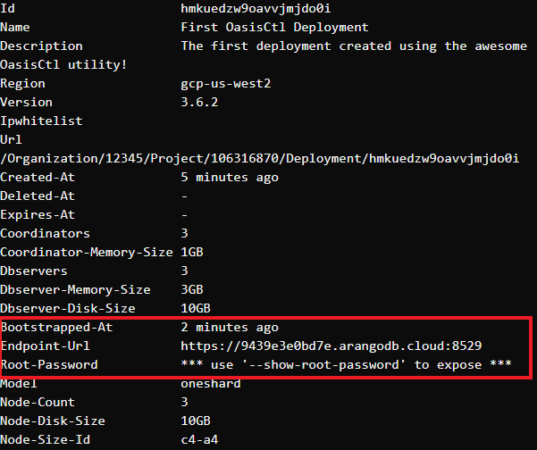

Once the deployment is ready you will get two new pieces of information, the
endpoint URL and Bootstrapped-At will indicate the time it became available.
If you would like to login to the WebUI to verify that your server is in fact
up and running you will need to supply the `--show-root-password` flag along
with the get command, this flag does not take a value.

### The Update Command

The inevitable time comes when something about your deployment must change and
this is where the update command comes in. You can use update to change or
update a number of things including updating the groups, policies, and roles
for user access control. You can also update some of your deployment
information or, for our situation, add an IP Allowlist if you didn’t add one
during creation.

There are, of course, many options available and it is always recommended to
start with the --help flag to read about all of them.

### Update a Deployment

This section will show an example of how to update a deployment to use a
pre-existing allowlist. To add an IP Allowlist after the fact we are really
just updating the IP Allowlist value, which is currently empty. In order to
update the IP Allowlist of a deployment you must create a allowlist and then
you can simply reference its id like so:

```bash
oasisctl update deployment \
  --deployment-id hmkuedzw9oavvjmjdo0i \
  --ipallowlist-id abc123AllowlistID
```

You should receive a response with the deployment information and an indication
that deployment was updated at the top.

You can use the update command to update everything about your deployments as
well. If you run:

```bash
oasisctl update deployment --help
```

You will see the full list of options available that will allow you to scale
your deployment as needed.

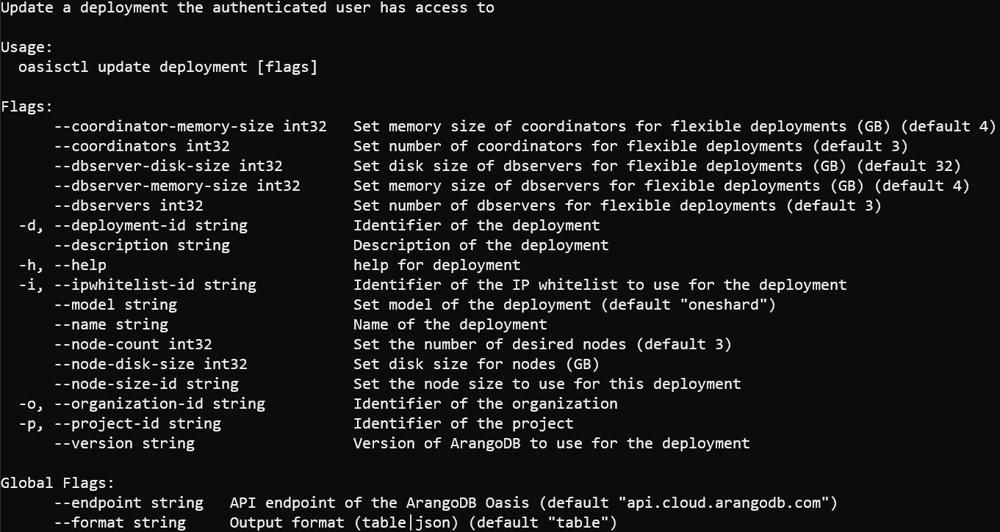

## Delete a Deployment

There may come a day where you need to delete a resource. The process for this
follows right along with the conventions for the other commands detailed
throughout this guide.

### The Delete Command

For the final example in this guide we will delete the deployment that has
been created. This only requires the deployment ID and the permissions to
delete the deployment.

```bash
oasisctl delete deployment \
  --deployment-id hmkuedzw9oavvjmjdo0i
```

Once the deployment has been deleted you can confirm it is gone by listing
your deployments.

```bash
oasisctl list deployments \
  --organization-id "Oasis Organization" \
  --format json
```

## Next Steps

As promised, this guide covered the basics of using Oasisctl with the ArangoDB
API. While we primarily focused on viewing and managing deployments there is
also a lot more to explore, including:

- Organization Invites Management
- Backups
- API Key Management
- Certificate Management
- User Access Control

You can check out all these features and further details on the ones discussed
in this guide in the documentation.
