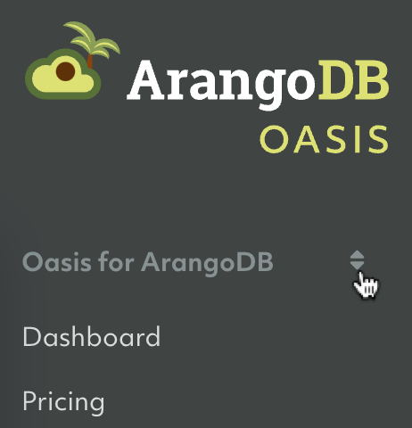
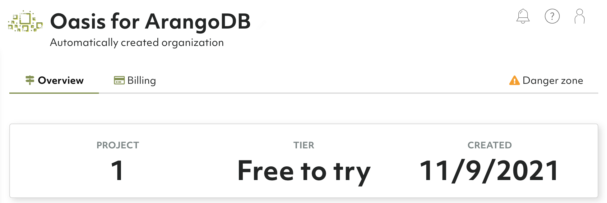
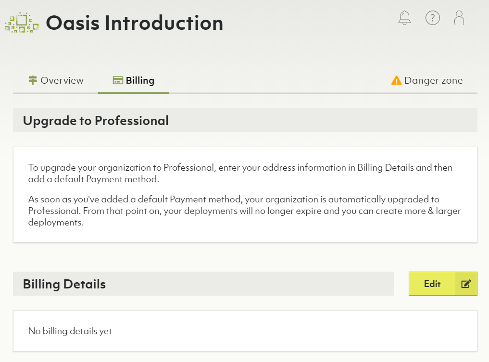

# Organizations

At the highest level of the Oasis deployment hierarchy are organizations.
Organizations are a container for projects.

**<u>Organizations</u> → Projects → Deployments**

An organization typically represents a (commercial) entity such as a company,
a company division, an institution or a non-profit organization.

Users can be members of one or more organizations. However, you can only be a
member of one _Free-to-try_ tier organization at a time.

## How to switch between my organizations

1. The first entry in the main navigation (with a double arrow icon) indicates
   the current organization.
2. Click it to bring up a dropdown menu to select another organization of which you
   are a member.
3. The overview will open for the selected organization, showing the number of
   projects, the tier and when it was created.

## Oasis tiers

With ArangoDB Oasis, your organization can belong to one of the following three tiers:

- **Free-to-try tier**: ArangoDB Oasis comes with a free-to-try tier that lets
you test the ArangoDB Cloud for free for 14 days. After the trial period,
your deployments will be deleted automatically. Includes the Basic Support plan,
which covers the availability and connectivity of the Oasis platform, and general questions.
- **Professional tier**: Allows you to create additional organizations and
projects, and have more and larger deployments. Includes the Standard support for
professional deployments, which covers everything from the Basic support plan
with explicit response times.
- **Enterprise tier**: Get unlimited access to all functionalities and resources,
with the best available support and response times. Includes the Premium Standard
support plan.

| &nbsp;| Free-to-try  | Professional  | Enterprise  |
|-------|--------------|---------------|-------------|
| Organizations | 1 | Unlimited | Unlimited |
| Projects per organization | 1 | 3 | Unlimited |
| Deployments per project | 1 | 5 | Unlimited |
| Deployment nodes | Up to 3 nodes | Unlimited | Unlimited | 
| Memory per node | 2 GB | 256 GB | Unlimited |
| Total memory per project | 96 GB | 2048 GB | Unlimited | 
| Storage per node | 150 GB | 6400 GB | Unlimited |  
| Total storage per project | 450 GB | 64000 GB | Unlimited | 
| Upload backup | Not included | Included | Included |
| Private endpoint deployment | Not included | Included | Included |
| Support plan | Basic | Standard | Premium Standard |

## How to upgrade to Professional tier

You can upgrade to the professional service model at any time by adding
your billing details and at least one payment method. You can then create
additional organizations and projects and have more and larger deployments.

See [Billing: How to add billing details / payment methods](billing.html)

## How to upgrade to Enterprise tier

To upgrade to the Enterprise tier, you need to get in touch with the ArangoDB
team. [Contact us]https://www.arangodb.com/contact/){:target="_blank"} for more details.

## How to create a new organization

See [My Account: How to create a new organization](my-account.html#how-to-create-a-new-organization)

## How to restrict access to an organization

If you want to restrict access to an organization, you can do it by specifying which authentication providers are accepted for users trying to access the organization. For more information, refer to the [Access Control](access-control.html#restricting-access-to-organizations) section.

## How to delete the current organization


Removing an organization implies the deletion of projects and deployments.
This operation cannot be undone and **all deployment data will be lost**.
Please proceed with caution.


1. Click **Overview** in the **Organization** section of the main navigation.
2. Open the **Danger zone** tab.
3. Click the **Delete organization** button.
4. Enter `Delete!` to confirm and click **Yes**.


If you are no longer a member of any organization, then a new organization is
created for you when you log in again.



If the organization has a locked resource (a project or a deployment), you need to [unlock](access-control.html#locked-resources)
that resource first to be able to delete the organization.
