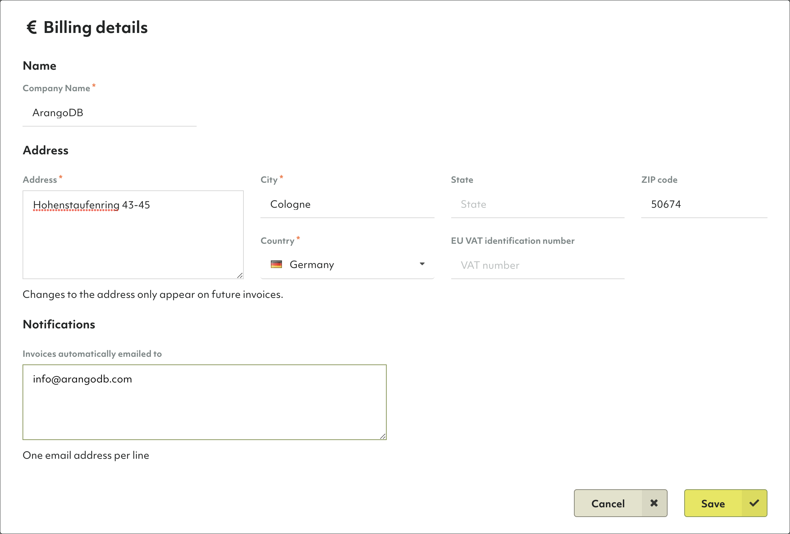
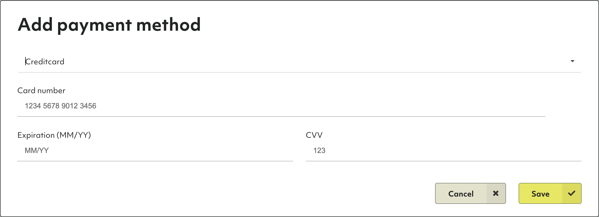

# Organizations

At the highest level of the Oasis deployment hierarchy are organizations.
Organizations are a container for projects.

**<u>Organizations</u> → Projects → Deployments**

An organization typically represents a (commercial) entity such as a company,
company division, institution or non-profit organization.

Users can be members of one or more organizations. However, you can only be a
member of one _Free to try_ tier organization at a time.

## How to switch between my organizations

1. The first entry in the main navigation (with a double arrow icon) indicates
   the current organization.
2. Click on it to bring up a dropdown menu to select another organization your
   are a member of.
3. The overview will open for the selected organization, showing the number of
   projects, the tier and when it was created.

## How to upgrade to professional

ArangoDB Oasis comes with a free-to-try tier that lets you test our ArangoDB
Cloud for free for 14 days. After the trial period, your deployments will
automatically be deleted.

You can convert to the professional service model at any time by adding
your billing details and at least one payment method. You can then create
additional organizations and projects and have more and larger deployments.

### How to add billing details

1. Click on _Overview_ in the _Organization_ section of the main navigation.
2. Click on the _Billing_ tab.
3. In the _Billing Details_ section, click the _Edit_ button.
4. Enter your billing address and EU VAT identification number (if applicable).
   Note that if you are located within the EU and you do not provide a VAT number,
   or you are located in Germany,
   VAT will be added to your invoices.
5. Optionally, enter the email address(es) to which invoices should be emailed
   to automatically.
6. Click on _Save_.

### How to add a payment method

1. Click on _Overview_ in the _Organization_ section of the main navigation.
2. Click on the _Billing_ tab.
3. In the _Payment methods_ section, click the _Add_ button.
4. From the dropdown, select a payment type
   (currently, only credit card is supported).
5. Fill out the form with your credit card details.
6. Click the _Save_ button.


TODO: Need screenshot with invoice

### How to view invoices

1. In the _Invoices_ section,



## How to create a new organization

See [My Account: How to create a new organization](my-account.html#how-to-create-a-new-organization)

## How to delete the current organization


Removing an organization implies the deletion of projects and deployments.
This operation cannot be undone and **all deployment data will be lost**.
Please proceed with caution.


1. Click on _Overview_ in the _Organization_ section of the main navigation.
2. Click on the _Danger zone_ tab.
3. Click on the _Delete organization..._ button.
4. Enter `Delete!` to confirm and click on _Yes_.


If you are no longer a member of any organization, then a new organization is
created for you when you log in again.

